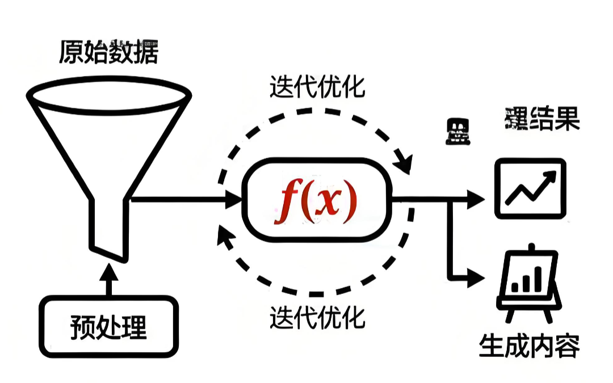
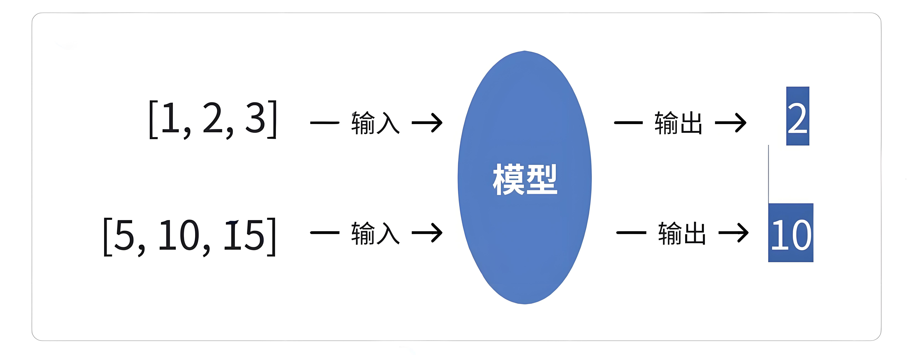
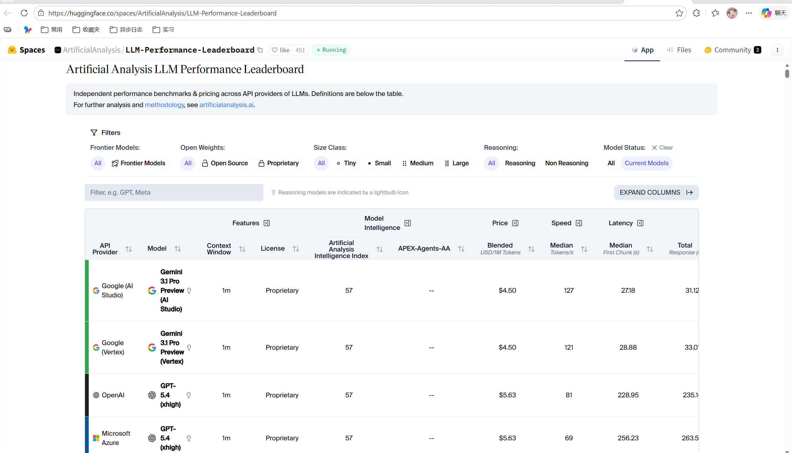

## 认识模型
模型是⼀个**从数据中学习规律的“数学函数”或“程序”**。旨在处理和⽣成信息的算法，通常模仿⼈ 类的认知功能。通过从⼤型数据集中学习模式和洞察，这些模型可以进⾏预测、⽣成⽂本、图像或其 他输出，从⽽增强各个⾏业的各种应⽤。
> 如\[16 96 16\] 96
>     \[51 66 56\] 66
>     \[51 84 15\] 84
>   规则：输出三个数的中间数 模型：从数据中找到规律  也就是一个数学函数or程序

可以简单理解为模型是一个 "超级加工厂"，这个工厂是经过特殊训练的，训练师给它看了海量的例子 (数据)，并告诉它该怎么做。通过看这些例子，它自己摸索出了一套规则，学会了完成某个 "特定任务"。模型就是一套学到的 "规则" 或者 "模式", 它能根据你给的东西，产生你想要的东西。

最简单的比喻：给模型很多组数据：

模型的任务就是找出输入和输出之间的规律（比如：输出是中间那个数）。学成之后：当我们再输入`[8, 9, 10]`时，它能根据学到的规律预测出输出应该是`9`。

模型的关键特点在于：

1. **特定任务**：一个模型通常**只擅长一件事**。比如：
    
    - 一个模型专门识别图片里是不是猫。
    - 一个模型专门预测明天会不会下雨。
    - 一个模型专门判断一条评论是好评还是差评。
    
2. **需要 "标注数据"**：训练这种模型需要大量 "标准答案"。（比如：成千上万张已经标注好 "是猫" 或 "不是猫" 的图片）。
    
3. **参数较少**：参数是模型从数据中学到的 "知识要点" 或 "内部规则"（比如：上述示例中的规则仅是 "中间数"）。参数较少说明模型的复杂度和能力相对有限。

## 认识大模型（LLM）

大语言模型（Large Language Model，LLM）是基于大规模神经网络（参数规模通常达数十亿至万亿级别，例如 GPT-3 包含 1750 亿参数），通过自监督或半监督方式，对海量文本进行训练的语言模型。

---

### 名词解释：

#### 1. 神经网络：一个极其高效的 “团队工作流程” 或 “条件反射链”

例如教一个小朋友识别猫：

- 不会只给一条规则（比如 “有胡子就是猫”），因为兔子也有胡子。
- 我们会让他看很多猫的图片，他大脑里的视觉神经会协同工作：
    
    - 有的神经元负责识别 “尖耳朵”，
    - 有的负责识别 “胡须”，
    - 有的负责识别 “毛茸茸的尾巴”。
    
- 这些神经元一层层地传递和组合信息，最后大脑综合判断：“这是猫！”

**神经网络**就是模仿人脑的这种工作方式。

- 它由大量虚拟的 “神经元”（也就是参数）和连接组成。
- 每个神经元都像一个小处理单元，负责处理一点点信息。无数个神经元分成很多层，前一层的输出作为后一层的输入。（例如：神经元1识别耳朵，神经元2识别眼睛，神经元3识别胡须。 神经元1将识别耳朵传递给神经元2，经过神经元2后，就可以将耳朵和眼睛合并传递给神经元3。 这个过程直到所有神经元识别结束，则可以构成一个完整的猫）
- 通过海量数据的训练，这个网络会自己调整每个 “神经元” 的重要性（即参数的值）（每个神经元对于其识别的内容，可以随着训练而发生变化。例如：猫的尾巴有长有短，随着不同图片的猫尾长度的不同，而导致其识别长短范围一直改变。），最终形成一个非常复杂的 “判断流水线”。比如，一个识别猫的神经网络，某些参数可能专门负责识别猫的眼睛，另一些参数专门负责识别猫的轮廓。

**简单说：神经网络就是一个通过数据训练出来的、由大量参数组成的复杂决策系统。**

#### 2. 自监督学习

自监督学习是 “完形填空” 超级大师。

例如我们想学会一门外语，但没有老师给出题和批改。怎么办？

- 我们可以拿一本该语言的小说，自己玩 “完形填空”：随机盖住一个词，然后根据上下文猜测这个词是什么。
- 一开始猜得乱七八糟。
- 但不断地重复这个过程，看了成千上万本书后，对这个语言的语法、词汇搭配、上下文逻辑了如指掌。现在不仅能轻松猜对被盖住的词，甚至能自己写出流畅的文章。

自监督学习就是这个过程。

- 模型面对海量的、没有标签的原始文本（比如互联网上的所有文章、网页）。
- 它自己给自己创造任务：把一句话中间的某个词遮住，然后尝试根据前后的词来预测这个被遮住的词。
- 通过亿万次这样的练习，模型就深刻地学会了语言的规律。它不需要人类手动去给每句话标注 “这是主语”、“这是谓语”。

> 例如：我是一\_\_\_\_程序员。 这里可能填 个 名 只 头 等，那么自监督学习就会在成千上万次练习后，学习预测下一个词，就可以掌握规律，应该填写什么

简单说：自监督就是让模型从数据本身找规律，自己给自己当老师。

#### 3. 半监督学习

半监督学习是 “师父领进门，修行在个人”。

例如你想学做菜：

- 师傅先教你几道招牌菜（比如麻婆豆腐、宫保鸡丁）—— 这相当于给了你一些 “有标注的数据”（菜谱和成品）。
- 然后，师傅让你去尝遍天下各种美食，自己研究其中的门道 —— 这相当于接触海量的 “无标注数据”（各种未知的食材和味道）。
- 你结合师傅教的基本功和自己尝遍天下美食的经验，最终不仅能完美复刻招牌菜，还能创新出新的菜式。这就是 “半监督”。

先用少量带标签的数据让模型 “入门”，掌握一些基本规则，然后再让它去海量的无标签数据中自学习和提升。这对于大语言模型来说也是一种常用的训练方式。

简单说：半监督就是 “少量指导 + 大量自学” 的结合模式。

#### 4. 语言模型

语言模型是一个 “超级自动补全” 或 “语言预测器”。

例如你在用手机打字，输入 “今天天气真”，输入法会自动提示 “好”、“不错”、“冷” 等。这个输入法之所以能提示，就是因为它内部有一个小型的 “语言模型”，它根据你输入的前文，计算下一个词最可能是什么。

语言模型的核心任务就是预测下一个词。一个强大的语言模型，能够根据一段话，预测出最合理、最通顺的下一个词是什么，这样一个个词接下去，就能生成一整段话、一篇文章。

简单说：语言模型就是一个计算 “接下来最可能说什么” 的模型。

现在，我们再回头看那段描述，就一目了然了。翻译成大白话就是：

大语言模型是一个：

- 用 “超级团队工作流程”（大规模神经网络）搭建的，拥有数百亿甚至上万亿个 “脑细胞”（参数）的 “超级自动补全系统”（语言模型）。
- 它学习的方式，主要是通过自己玩 “海量完形填空”（自监督学习），或者 “少量名师指导 + 海量自学”（半监督学习）……
- 从互联网上所有的文本数据中学会了语言的规律。

因此，它具有以下几个核心特点：

- **规模巨大**：它的 “脑细胞”（参数）特别多（通常达到数十亿甚至万亿级别），所以思考问题更复杂、更全面，就像一支百万大军和一个小分队的区别。
- **通用性强**：它不是为单一任务训练的。因为它通过 “完形填空” 学会的是整个语言世界的底层规律（语法、逻辑、知识关联），而不是只背会了 “猫的图片”。所以它能举一反三，把底层能力灵活应用到聊天、翻译、写代码等各种任务上。这种 “涌现” 能力，就像孩子通过大量阅读后，突然能写出意想不到的优美句子一样。
- **训练方式不同**：主要使用自监督学习，从海量无标注的原始文本中学习。它不依赖人工一张张地给图片标 “这是猫”，而是直接从原始文本中自学，效率极高，规模可以做得非常大。
- **交互方式革命**：我们不用点按钮、写代码，直接像对人说话一样给它指令（Prompt），它就能听懂并执行，比如你直接说 “写一首关于春天的诗”，它就能给你写出来。

## 2. 主流的大语言模型

- **GPT-5 (OpenAI)**：支持 400k 背景信息长度，128k 最大输出标记，在多轮复杂推理、创意写作中表现突出
- **DeepSeek R1 (深度求索)**：开源，专注于逻辑推理与数学求解，支持 128K 长上下文和多语言 (20 + 语言)，在科技领域表现突出
- **Qwen2.5-72B-Instruct (阿里巴巴)**：通义千问开源模型家族重要成员，擅长代码生成结构化数据（如 JSON）处理角色扮演对话等，尤其适合企业级复杂任务，支持包括中文英文法语等 29 种语言
- **Gemini 2.5 Pro (Google)**：多模态融合标杆，支持图像 / 代码 / 文本混合输入，适合跨模态任务 (如图文生成、技术文档解析)

### 其他参考：

- Huggingface LLM 性能排行榜：[https://huggingface.co/spaces/ArtificialAnalysis/LLM-Performance-Leaderboard](https://huggingface.co/spaces/ArtificialAnalysis/LLM-Performance-Leaderboard)

- [发展历程参考](https://segmentfault.com/a/1190000046532208)

## 2. LLM 的能力包括哪些？
大模型，对不少人来说已变得耳熟能详，从大型科技公司到初创企业，都纷纷投身于这场技术变革。AI 大模型不仅仅是技术圈的热门话题，它也正日新月异的速度融入我们的日常生活，改变着我们获取信息、处理工作、甚至进行创作的方式。

我们将大模型的能力归纳为四点，这不仅仅是技术指标，更是它改变世界的核心利器。

---

## 3.1 语言大师：理解与创造的革命

想象一下，你是否发生过以下类似问题：

- 对学生：你是否为论文的开头绞尽脑汁？
- 对职场人：一封礼貌又坚决的投诉邮件怎么写？

LLM 可以干什么？对于：

- 论文的开头：告诉大模型你的主题和观点，它能为你生成几个不同风格的引言段落。例如：**"写一篇关于《基于深度学习的晶粒度智能评级方法》的大学生论文开头供我参考。"**
- 投诉邮件：把情况告诉它，它即刻生成，你稍作修改就能发送。例如：**"帮我写一封礼貌又坚决的投诉邮件，事情的经过是：xxx"**

我们发现，它真正 “读懂” 了人类语言的千变万化，并能进行高质量创作。这不是简单的关键词匹配，而是理解了上下文、情感甚至潜台词。

---

## 3.2 知识巨人：拥有 “全互联网” 的记忆

我们可以问它：**"用物理学原理解释为什么猫咪总能四脚着地？"** 它不仅能回答，还能类比。

我们可以让它：**"对比一下古希腊哲学和春秋战国百家争鸣的异同"**。它能为我们提供清晰的思路。

可以看出，大模型是一个被压缩的、可对话的 “互联网知识库”。它通过学习海量数据，将知识内在关联，形成了一个立体的知识网络，而不仅仅是存储。

---

## 3.3 逻辑与代码巫师：从思维到实现的跨越

一个复杂的功能，对程序员来说，只需用中文描述：**"写一个 Python 函数，能自动爬取某个网页的最新标题并保存到 Excel 里。"** 代码瞬间生成。

我们可以把一道复杂的数学题丢给它，如 **"微分方程 y''-3y'+2y=3x-2e^x 的特解 y * 的形式为？"**，它不仅能给出答案，还能一步步展示解题过程，成为你的私人家教。

可以看出，大模型不仅能处理语言，还能处理严格的逻辑和编程语法。这证明了它的能力超越了 “文科”，进入了需要精确和推理的 “理科” 领域。

---

## 3.4 多模态先知：开启 “全感知” AI 的大门

想象一下，上传一张照片，再加入一段描述，AI 可实现快速的对话式创意工作流程。

参考链接：[https://nanobanana.im/](https://nanobanana.im/)

- AI 婴儿预测和生成：**"生成他们的宝宝的样子 - 父母双方特征的融合。专业的照片质量。"**
- 3D 图形：**"请把这张照片变成一个人物。在它后面，放置一个印有角色形象的盒子。在它旁边，添加一台计算机，其屏幕显示 Blender 建模过程。在盒子前面，为人偶添加一个圆形塑料底座，让它站在上面。底座的 PVC 材质应具有晶莹剔透、半透明的质感，并将整个场景设置在室内。"**

可以看到，它打破 “文本” 的界限，连接视觉、听觉的世界，让 AI 更接近人类的感知方式。这是目前最前沿、最令人兴奋的能力，它让 AI 真正成为 “全能型” 助手。
