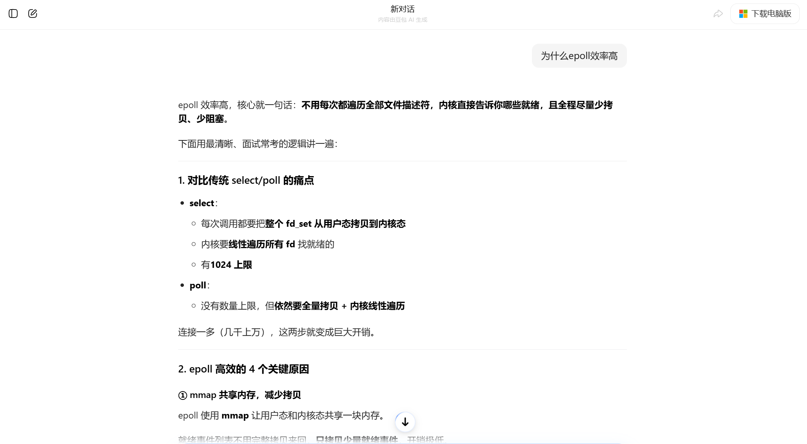
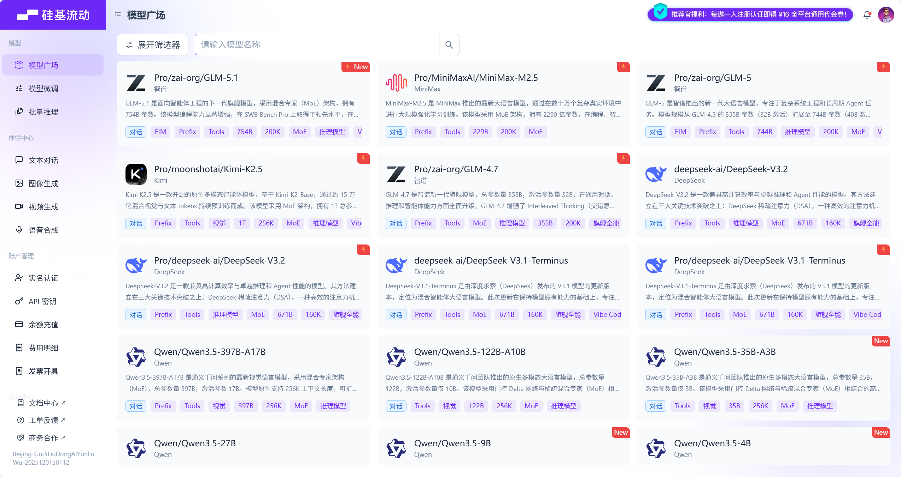
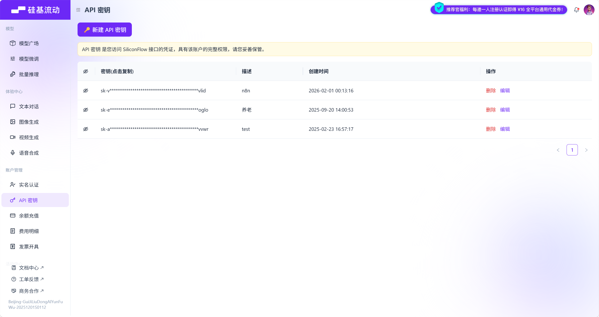

## 一、认识模型
模型是⼀个**从数据中学习规律的“数学函数”或“程序”**。旨在处理和⽣成信息的算法，通常模仿⼈ 类的认知功能。通过从⼤型数据集中学习模式和洞察，这些模型可以进⾏预测、⽣成⽂本、图像或其 他输出，从⽽增强各个⾏业的各种应⽤。
> 如\[16 96 16\] 96
>     \[51 66 56\] 66
>     \[51 84 15\] 84
>   规则：输出三个数的中间数 模型：从数据中找到规律  也就是一个数学函数or程序


可以简单理解为模型是一个 "超级加工厂"，这个工厂是经过特殊训练的，训练师给它看了海量的例子 (数据)，并告诉它该怎么做。通过看这些例子，它自己摸索出了一套规则，学会了完成某个 "特定任务"。模型就是一套学到的 "规则" 或者 "模式", 它能根据你给的东西，产生你想要的东西。

最简单的比喻：给模型很多组数据：


模型的任务就是找出输入和输出之间的规律（比如：输出是中间那个数）。学成之后：当我们再输入`[8, 9, 10]`时，它能根据学到的规律预测出输出应该是`9`。

模型的关键特点在于：

1. **特定任务**：一个模型通常**只擅长一件事**。比如：
    
    - 一个模型专门识别图片里是不是猫。
    - 一个模型专门预测明天会不会下雨。
    - 一个模型专门判断一条评论是好评还是差评。
    
2. **需要 "标注数据"**：训练这种模型需要大量 "标准答案"。（比如：成千上万张已经标注好 "是猫" 或 "不是猫" 的图片）。
    
3. **参数较少**：参数是模型从数据中学到的 "知识要点" 或 "内部规则"（比如：上述示例中的规则仅是 "中间数"）。参数较少说明模型的复杂度和能力相对有限。


## 二、认识大语言模型（LLM）

大语言模型（Large Language Model，LLM）是基于大规模神经网络（参数规模通常达数十亿至万亿级别，例如 GPT-3 包含 1750 亿参数），通过自监督或半监督方式，对海量文本进行训练的语言模型。

---

### 什么是大语言模型：

#### 1. 神经网络：一个极其高效的 “团队工作流程” 或 “条件反射链”

例如教一个小朋友识别猫：

- 不会只给一条规则（比如 “有胡子就是猫”），因为兔子也有胡子。
- 我们会让他看很多猫的图片，他大脑里的视觉神经会协同工作：
    
    - 有的神经元负责识别 “尖耳朵”，
    - 有的负责识别 “胡须”，
    - 有的负责识别 “毛茸茸的尾巴”。
    
- 这些神经元一层层地传递和组合信息，最后大脑综合判断：“这是猫！”

**神经网络**就是模仿人脑的这种工作方式。

- 它由大量虚拟的 “神经元”（也就是参数）和连接组成。
- 每个神经元都像一个小处理单元，负责处理一点点信息。无数个神经元分成很多层，前一层的输出作为后一层的输入。（例如：神经元1识别耳朵，神经元2识别眼睛，神经元3识别胡须。 神经元1将识别耳朵传递给神经元2，经过神经元2后，就可以将耳朵和眼睛合并传递给神经元3。 这个过程直到所有神经元识别结束，则可以构成一个完整的猫）
- 通过海量数据的训练，这个网络会自己调整每个 “神经元” 的重要性（即参数的值）（每个神经元对于其识别的内容，可以随着训练而发生变化。例如：猫的尾巴有长有短，随着不同图片的猫尾长度的不同，而导致其识别长短范围一直改变。），最终形成一个非常复杂的 “判断流水线”。比如，一个识别猫的神经网络，某些参数可能专门负责识别猫的眼睛，另一些参数专门负责识别猫的轮廓。

**简单说：神经网络就是一个通过数据训练出来的、由大量参数组成的复杂决策系统。**


#### 2. 自监督学习

自监督学习是 “完形填空” 超级大师。

例如我们想学会一门外语，但没有老师给出题和批改。怎么办？

- 我们可以拿一本该语言的小说，自己玩 “完形填空”：随机盖住一个词，然后根据上下文猜测这个词是什么。
- 一开始猜得乱七八糟。
- 但不断地重复这个过程，看了成千上万本书后，对这个语言的语法、词汇搭配、上下文逻辑了如指掌。现在不仅能轻松猜对被盖住的词，甚至能自己写出流畅的文章。

自监督学习就是这个过程。

- 模型面对海量的、没有标签的原始文本（比如互联网上的所有文章、网页）。
- 它自己给自己创造任务：把一句话中间的某个词遮住，然后尝试根据前后的词来预测这个被遮住的词。
- 通过亿万次这样的练习，模型就深刻地学会了语言的规律。它不需要人类手动去给每句话标注 “这是主语”、“这是谓语”。

> 例如：我是一\_\_\_\_程序员。 这里可能填 个 名 只 头 等，那么自监督学习就会在成千上万次练习后，学习预测下一个词，就可以掌握规律，应该填写什么


简单说：自监督就是让模型从数据本身找规律，自己给自己当老师。

#### 3. 半监督学习

半监督学习是 “师父领进门，修行在个人”。

例如你想学做菜：

- 师傅先教你几道招牌菜（比如麻婆豆腐、宫保鸡丁）—— 这相当于给了你一些 “有标注的数据”（菜谱和成品）。
- 然后，师傅让你去尝遍天下各种美食，自己研究其中的门道 —— 这相当于接触海量的 “无标注数据”（各种未知的食材和味道）。
- 你结合师傅教的基本功和自己尝遍天下美食的经验，最终不仅能完美复刻招牌菜，还能创新出新的菜式。这就是 “半监督”。

先用少量带标签的数据让模型 “入门”，掌握一些基本规则，然后再让它去海量的无标签数据中自学习和提升。这对于大语言模型来说也是一种常用的训练方式。

简单说：半监督就是 “少量指导 + 大量自学” 的结合模式。

#### 4. 语言模型

语言模型是一个 “超级自动补全” 或 “语言预测器”。

例如你在用手机打字，输入 “今天天气真”，输入法会自动提示 “好”、“不错”、“冷” 等。这个输入法之所以能提示，就是因为它内部有一个小型的 “语言模型”，它根据你输入的前文，计算下一个词最可能是什么。

语言模型的核心任务就是预测下一个词。一个强大的语言模型，能够根据一段话，预测出最合理、最通顺的下一个词是什么，这样一个个词接下去，就能生成一整段话、一篇文章。

简单说：语言模型就是一个计算 “接下来最可能说什么” 的模型。

现在，我们再回头看那段描述，就一目了然了。翻译成大白话就是：

大语言模型是一个：

- 用 “超级团队工作流程”（大规模神经网络）搭建的，拥有数百亿甚至上万亿个 “脑细胞”（参数）的 “超级自动补全系统”（语言模型）。
- 它学习的方式，主要是通过自己玩 “海量完形填空”（自监督学习），或者 “少量名师指导 + 海量自学”（半监督学习）……
- 从互联网上所有的文本数据中学会了语言的规律。

因此，它具有以下几个核心特点：

- **规模巨大**：它的 “脑细胞”（参数）特别多（通常达到数十亿甚至万亿级别），所以思考问题更复杂、更全面，就像一支百万大军和一个小分队的区别。
- **通用性强**：它不是为单一任务训练的。因为它通过 “完形填空” 学会的是整个语言世界的底层规律（语法、逻辑、知识关联），而不是只背会了 “猫的图片”。所以它能举一反三，把底层能力灵活应用到聊天、翻译、写代码等各种任务上。这种 “涌现” 能力，就像孩子通过大量阅读后，突然能写出意想不到的优美句子一样。
- **训练方式不同**：主要使用自监督学习，从海量无标注的原始文本中学习。它不依赖人工一张张地给图片标 “这是猫”，而是直接从原始文本中自学，效率极高，规模可以做得非常大。
- **交互方式革命**：我们不用点按钮、写代码，直接像对人说话一样给它指令（Prompt），它就能听懂并执行，比如你直接说 “写一首关于春天的诗”，它就能给你写出来。


### 2. 主流的大语言模型

- **GPT-5 (OpenAI)**：支持 400k 背景信息长度，128k 最大输出标记，在多轮复杂推理、创意写作中表现突出
- **DeepSeek R1 (深度求索)**：开源，专注于逻辑推理与数学求解，支持 128K 长上下文和多语言 (20 + 语言)，在科技领域表现突出
- **Qwen2.5-72B-Instruct (阿里巴巴)**：通义千问开源模型家族重要成员，擅长代码生成结构化数据（如 JSON）处理角色扮演对话等，尤其适合企业级复杂任务，支持包括中文英文法语等 29 种语言
- **Gemini 2.5 Pro (Google)**：多模态融合标杆，支持图像 / 代码 / 文本混合输入，适合跨模态任务 (如图文生成、技术文档解析)

### 其他参考：

- Huggingface LLM 性能排行榜：[https://huggingface.co/spaces/ArtificialAnalysis/LLM-Performance-Leaderboard](https://huggingface.co/spaces/ArtificialAnalysis/LLM-Performance-Leaderboard)


- [发展历程参考](https://segmentfault.com/a/1190000046532208)


## 三、 LLM 的能力包括哪些？
大模型，对不少人来说已变得耳熟能详，从大型科技公司到初创企业，都纷纷投身于这场技术变革。AI 大模型不仅仅是技术圈的热门话题，它也正日新月异的速度融入我们的日常生活，改变着我们获取信息、处理工作、甚至进行创作的方式。

我们将大模型的能力归纳为四点，这不仅仅是技术指标，更是它改变世界的核心利器。

---

#### 3.1 语言大师：理解与创造的革命

想象一下，你是否发生过以下类似问题：

- 对学生：你是否为论文的开头绞尽脑汁？
- 对职场人：一封礼貌又坚决的投诉邮件怎么写？

LLM 可以干什么？对于：

- 论文的开头：告诉大模型你的主题和观点，它能为你生成几个不同风格的引言段落。例如：**"写一篇关于《基于深度学习的晶粒度智能评级方法》的大学生论文开头供我参考。"**
- 投诉邮件：把情况告诉它，它即刻生成，你稍作修改就能发送。例如：**"帮我写一封礼貌又坚决的投诉邮件，事情的经过是：xxx"**

我们发现，它真正 “读懂” 了人类语言的千变万化，并能进行高质量创作。这不是简单的关键词匹配，而是理解了上下文、情感甚至潜台词。

---

#### 3.2 知识巨人：拥有 “全互联网” 的记忆

我们可以问它：**"用物理学原理解释为什么猫咪总能四脚着地？"** 它不仅能回答，还能类比。

我们可以让它：**"对比一下古希腊哲学和春秋战国百家争鸣的异同"**。它能为我们提供清晰的思路。


可以看出，大模型是一个被压缩的、可对话的 “互联网知识库”。它通过学习海量数据，将知识内在关联，形成了一个立体的知识网络，而不仅仅是存储。

---

#### 3.3 逻辑与代码巫师：从思维到实现的跨越

一个复杂的功能，对程序员来说，只需用中文描述：**"写一个 Python 函数，能自动爬取某个网页的最新标题并保存到 Excel 里。"** 代码瞬间生成。

我们可以把一道复杂的数学题丢给它，如 **"微分方程 y''-3y'+2y=3x-2e^x 的特解 y * 的形式为？"**，它不仅能给出答案，还能一步步展示解题过程，成为你的私人家教。

可以看出，大模型不仅能处理语言，还能处理严格的逻辑和编程语法。这证明了它的能力超越了 “文科”，进入了需要精确和推理的 “理科” 领域。

---

#### 3.4 多模态先知：开启 “全感知” AI 的大门

想象一下，上传一张照片，再加入一段描述，AI 可实现快速的对话式创意工作流程。

参考链接：[https://nanobanana.im/](https://nanobanana.im/)

- AI 婴儿预测和生成：**"生成他们的宝宝的样子 - 父母双方特征的融合。专业的照片质量。"**
- 3D 图形：**"请把这张照片变成一个人物。在它后面，放置一个印有角色形象的盒子。在它旁边，添加一台计算机，其屏幕显示 Blender 建模过程。在盒子前面，为人偶添加一个圆形塑料底座，让它站在上面。底座的 PVC 材质应具有晶莹剔透、半透明的质感，并将整个场景设置在室内。"**

可以看到，它打破 “文本” 的界限，连接视觉、听觉的世界，让 AI 更接近人类的感知方式。这是目前最前沿、最令人兴奋的能力，它让 AI 真正成为 “全能型” 助手。


### 4.提示词编写技巧


编写合理且有效的提示词，是我们与 AI 进行有效对话的第一步，好的提示词能显著提升模型输出的质量和相关性。**宗旨就是：将你的问题限定范围，让 AI 知道你要的答案具体要包含什么，提示词效果会大幅提升。**

核心在于**换位思考**：想象 AI 对你提供的信息一无所知，你需要清晰、具体、无歧义地告诉它你要什么、在什么背景下、以什么方式呈现。善用示例、角色扮演、具体约束和迭代优化。

提示技巧不止一种，掌握多种技巧，并根据不同任务灵活组合使用，才是成为提示词高手的秘诀。

---

#### 4.1 CO-STAR 结构化框架

在目标设定和问题解决的场景下，清晰性和结构性是至关重要的。而有一种方法论，在这些方面表现都非常出色，那就是 CO-STAR 框架。这个提示词编写框架，由新加坡政府技术局（GovTech）的数据科学与 AI 团队开发，重点在于确保提供给 LLM 的提示词是全面且结构良好的，从而生成更相关和准确的回答。

CO-STAR 可以拆解为六个维度：

|模块|说明|示例|
|:--|:--|:--|
|**Context**|任务背景与上下文|“你是电商客服，需解答用户关于 iPhone 17 的咨询，知识库包含最新价格和库存”|
|**Objective**|核心目标|“准确回答价格、发货时间，推荐适配配件”|
|**Steps**|执行步骤|“1. 识别用户问题类型；2. 检索知识库；3. 用亲切语气整理回复”|
|**Tone**|语言风格|“口语化，避免专业术语，使用‘亲～’‘呢’等语气词”|
|**Audience**|目标用户|“20-35 岁年轻消费者，对价格敏感，关注性价比”|
|**Response**|输出格式|“价格: XXX 元 \n 库存: XXX 件 \n 推荐配件: XXX（链接）”|
例如，我需要进行健康咨询，希望给出营养建议。那么我可以这样构建提示词：

**优化前（模糊、低效）：**

> 我该怎么吃才能更健康？

**优化后（清晰、有效）：**

>角色：你是一个基于科学证据的 AI 营养顾问。重要约束：你提供的所有建议都仅为通用信息，不能替代专业医疗诊断。在给出任何具体建议前，必须首先声明此免责条款。
>
>任务：基于以下用户信息，提供一份个性化的每日饮食原则性建议。
>
>用户信息:
> - 年龄: 30 岁
> - 性别：男性
> - 目标：减脂增肌
> - 日常活动水平：办公室久坐，每周进行 3 次力量训练
>   
 >   重构相关性。示目标定，待你的问题限足范围，让 AI 知道你要的答案具体要包含什么，提问效果会大幅提升。
>
> 4. 推荐 2 种适合该用户的具体健康零食。
> 5. 避免推荐任何具体的保健品或药物。
 >   
 >   输出格式:
 >   【免责声明】
 >   \[此处输出声明]
  >  【核心原则】
>- ...
>   【分餐建议】
>- 早餐: ...
>- 午餐: ...
 >   【健康零食推荐】
>4. ...
>5. ...

#### 4.2 少样本提示 / 多示例提示

这种方式通过给 AI 提供一两个 **输入 - 输出** 的例子，让它 “照葫芦画瓢”。

核心思想：你不是在给它下指令，而是在 “教” 它你想要的格式、风格和逻辑。

适用场景：格式固定、风格独特、逻辑复杂的任务，如风格仿写、数据提取、复杂格式生成。

例如:

优化前（零样本提示）：

`2 🦜 9等于多少?`

优化后（少样本提示）：
>根据以下示例，处理问题。 
>示例1: 2 🦜 3 = 5 
>示例2: 4 🦜 7 = 11 
>现在请分析这个: 2 🦜 9等于多少?

再例如:

优化前（零样本提示）：

> 请分析以下客户反馈，提取产品名称、情感倾向和具体问题。 
> 反馈: “我刚买的耳机，才用了一周左边就没声音了，太让人失望了。”

优化后（少样本提示）：
>请根据以下示例，分析后续的客户反馈，并提取产品名称、情感倾向和具体问题。 
>示例1: 
>- 反馈: “笔记本的电池续航太差了，完全达不到宣传的10小时，最多就4小时。” 
>- 分析: 
>	- 产品名称: 笔记本电池 
>	- 情感倾向: 负面 
>	- 具体问题: 续航远低于宣传 
>示例2: - 反馈: “客服响应很快，非常专业地帮我解决了软件激活问题，点赞！” 
>- 分析: 
>	- 产品名称: 客服服务 
>	- 情感倾向: 正面 
>	- 具体问题: 无 现在请分析这个: 
   反馈: “我刚买的耳机，才用了一周左边就没声音了，太让人失望了。”


通过示例，AI 清晰地学会了 “产品名称” 如何概括，“情感倾向” 的标签是什么，“具体问题” 如何简洁描述。这比单纯用文字描述规则要有效得多。

---

#### 4.3 思维链提示

提示工程的关键目标是让 AI 更好地理解复杂语义。这种能力的高低，可以直接通过模型处理复杂逻辑推理题的表现来检验。

可以这样理解：当好的提示词能帮助模型解决原本解决不了的难题时，就说明它确实提升了模型的推理水平。并且，提示词设计得越出色，这种提升效果就越显著。通过设置不同难度的推理测试，可以很清晰地验证这一点。

举个例子（该示例来自论文: [Large Language Models are Zero-Shot Reasoners]([[2205.11916] Large Language Models are Zero-Shot Reasoners](https://arxiv.org/abs/2205.11916))）：


**翻译一问题：**

> 杂耍者可以杂耍 16 个球。其中一半的球是高尔夫球，其中一半的高尔夫球是蓝色的。请问总共有多少个蓝色高尔夫球？

**推理结果**：

> 8 个蓝色高尔夫球

可以看到，答案错误。该逻辑题的数学计算过程并不复杂，但却设计了一个语言陷阱，即一半的一半是多少。

为了解决类似的逻辑问题，可以使用思维链提示。思维链提示相较于少样本提示是一种更好的提示方法，思维链提示最常用的两种方式：

- **Few-shot-CoT：少样本思维链**
- **Zero-shot-CoT：零样本思维链**

相比于少样本提示（Few-shot），少样本思维链（Few-shot-CoT）的不同之处只是在于需要在提示样本中不仅给出问题的答案、还同时需要给出问题推导的过程（即思维链），从而让模型学到思维链的推导过程，并将其应用到新的问题中。此技巧主要用于解决复杂推理问题，如数学、逻辑或多步骤规划。

**核心思想**：要求 AI “展示其工作过程”，而不是直接给出最终答案。这模仿了人类解决问题时的思考方式。

**适用场景**：数学题、逻辑推理、复杂决策、需要解释过程的任务。

**例如，手动写一个思维链作为少样本提示的示例：**

Q：“罗杰有五个网球，他又买了两盒网球，每盒有 3 个网球，请问他现在总共有多少个网球？”

A：“罗杰起初有五个网球，又买了两盒网球，每盒 3 个，所以，他总共买了 2×3=6 个网球，将起始的数量和购买的数量相加，可以得到他现在总共的网球数量：5+6=11，所以罗杰现在总共有 11 个网球”


在获得了一个思维链示例后，就可以以此作为样本进行 Few-shot-CoT 来解决第二个推理问题，如下所示：

```
示例 1：

Q：“罗杰有五个网球，他又买了两盒网球，每盒有 3 个网球，请问他现在总共有多少个网球？”

A：“罗杰起初有五个网球，又买了两盒网球，每盒 3 个，所以，他总共买了 2×3=6 个网球，将起始的数量和购买的数量相加，可以得到他现在总共的网球数量：5+6=11，所以罗杰现在总共有 11 个网球”

问：“食堂总共有 23 个苹果，如果他们用掉 20 个苹果，然后又买了 6 个苹果，请问现在食堂总共有多少个苹果？”
```


通过这个例子可以观察到，这就好像是 “把答案告诉了 AI”。从某种意义上说，是的，你告诉它的是 “回答这个问题的正确方式和步骤”，而不仅仅是最终的答案，AI 会模仿你提供的范本结构和逻辑，来解决新问题。

实际上，Few-shot-CoT 的方式虽然有效，但不一定是稳定且准确的。如果想要得到稳定的正确答案，需要更高阶的提示方法。你给的例子越详细，它模仿得就越像，这更像是一种 “教学” 或 “格式化”。当你有一个非常复杂的逻辑流程，或者你希望 AI 严格按照某种格式（比如先分析 A，再对比 B，最后总结 C）来输出时，就可以直接提供一个完美的 “思考过程” 作为范例。

#### 4.4 自动推理与零样本链式思考

零样本思维链（Zero-shot-CoT）是少样本思维链（Few-shot-CoT）的简化版。只需在提示词末尾加上一句魔法短语，即可激发 AI 的推理能力。

**核心思想**：通过指令 `请一步步进行推理并得出结论`，强制 AI 在给出答案前先进行内部推理。

适用场景：任何需要一点逻辑思考的问题，即使你不太清楚具体步骤。

例如：
```
罗杰有五个网球，他又买了两盒网球，每盒有 3 个网球，请问他现在总共有多少个网球？请一步步进行推理并得出结论。

AI 的输出可能会变成：

罗杰最初有 5 个网球。

他买了两盒网球，每盒有 3 个网球，所以买来的网球数量是：2 × 3 = 6 个网球。

因此，他现在总共有网球：5 + 6 = 11 个。

答案：11 个网球。

```
“一步步进行推理” 这个指令，相当于在引导模型的 “注意力机制”。它告诉模型：“在生成最终答案之前，请先在你的‘脑海’里（即生成的文本序列中）模拟出一个缓慢、有序的推理上下文。”

当模型开始输出 “第一步... 第二步...” 时，它实际上是在为自己创造一个更丰富、更逻辑化的上下文。它在这个自己创造的优质上下文中进行推理，最终得出的结论自然比在贫瘠的上下文中（只有原始问题）更准确。

根据《Large Language Models are Zero-Shot Reasoners》论文中的结论，从海量数据的测试结果来看，Few-shot-CoT 比 Zero-shot-CoT 准确率更高。

---

#### 4.5 自我批判与迭代

要求 AI 在生成答案后，从特定角度对自己的答案进行审查和优化。

**核心思想**：将 “生成” 和 “评审” 两个步骤分离，利用 AI 的批判性思维来提升内容质量。

**适用场景**：代码审查、文案优化、论证强化、安全检查。

**案例**：编写一段代码后进行检查

优化前：

> 写一个 Python 函数，计算列表中的最大值。

优化后：

```
请执行以下两个步骤：

步骤一：编写代码

写一个 Python 函数 `find_max`，用于计算一个数字列表中的最大值。

步骤二：自我审查与优化

现在，请从代码健壮性和可读性的角度，审查你上面编写的代码。

请回答：

1. 如果输入是空列表，函数会怎样？如何改进？
2. 变量命名和代码结构是否清晰？能否让它更易于理解？
3. 请根据你的审查，给出一个优化后的最终版本。
```

在实际应用中，这些技巧常常是组合使用的。例如，我们可以：

1. 使用 CO-STAR 框架设定基本结构和角色。
2. 在框架的 “Steps” 或 “Response” 部分，融入思维链指令。
3. 对于格式复杂的输出，在最后附上少样本示例。
4. 最后，要求 AI 进行自我审查。

我们更多使用 LLM 的场景大都是编写代码，如果你们用过 Cursor、Trae 这样的 AI IDE，应该不陌生在 AI 帮我们编码之前，需要配置相关的 “编码规则” --Rules。它其实就是这些 IDE 输入给 LLM 的提示词，告诉 LLM 编写代码时的注意事项与要求。

Cursor 官方提示词：[https://cursor.directory/rules](https://cursor.directory/rules)


### 6.LLM的接接入方式
前面我们演示的都是通过现成的客户端，来进行 AI 行为，如聊天、生图等。如果现在要我们自己写一个 AI 应用来实现相关 AI 行为，则需要我们自行接入 LLM。

常见的原生 LLM（不经过第三方平台或复杂的代理层，直接与大语言模型提供方进行交互的方法）接入方式有三种：**【API 远程调用】、【开源模型本地部署】和【SDK 和官方客户端库】**
> 实际上，本地部署开源大模型，不仅需要开放大模型的源代码，还包括模型的参数/权重、训练数据等


#### 6.1 API 接入

这是目前最主流、最便捷的接入方式，尤其适用于快速开发、集成到现有应用以及不想管理硬件资源的场景。

通过 HTTP 请求（通常是 RESTful API）直接调用模型提供商部署在云端的模型服务。代表厂商：OpenAI (GPT-4o)、Anthropic (Claude)、Google (Gemini)、百度文心一言、阿里通义千问、智谱 AI 等。

**典型流程就是：**

1. **注册账号并获取 API Key**：在模型提供商的平台上注册，获得用于身份验证的密钥。
2. **查阅 API 文档**：了解请求的端点、参数（如模型名称、提示词、温度、最大生成长度等）和返回的数据格式。
3. **构建 HTTP 请求**：在你的代码中，使用 HTTP 客户端库（如 Python 的 `requests`）构建一个包含 API Key（通常在 Header 中）和请求体（JSON 格式，包含你的提示和参数）的请求。
4. **发送请求并处理响应**：将请求发送到提供商指定的 API 地址，然后解析返回的 JSON 数据，提取生成的文本。

以 硅基流动 为例，官网地址：[[SiliconCloud](https://cloud.siliconflow.cn/me/models)]([SiliconCloud](https://cloud.siliconflow.cn/me/models))

接入流程参考：[[快速上手 - SiliconFlow](https://docs.siliconflow.cn/cn/userguide/quickstart)]([快速上手 - SiliconFlow](https://docs.siliconflow.cn/cn/userguide/quickstart))

如果没有账号先注册账号，登录成功后，出现  API 密钥 图标，点击 settings，选择 API keys 配置页面。


点击“新增API密钥”按钮，新增APIkey




```
调用：
curl --request POST \
  --url https://api.siliconflow.cn/v1/chat/completions \
  -H "Content-Type: application/json" \
  -H "Authorization: Bearer YOUR_API_KEY" \
  -d '{
    "model": "Pro/zai-org/GLM-4.7",
    "messages": [
      {"role": "system", "content": "你是一个有用的助手"},
      {"role": "user", "content": "你好，请介绍一下你自己"}
    ]
  }'
```

或使用 HTTP 客户端（如 Apifox）发起调用：

（部分平台：如GPT官方api，Gemini等，调用需要开启系统代理）