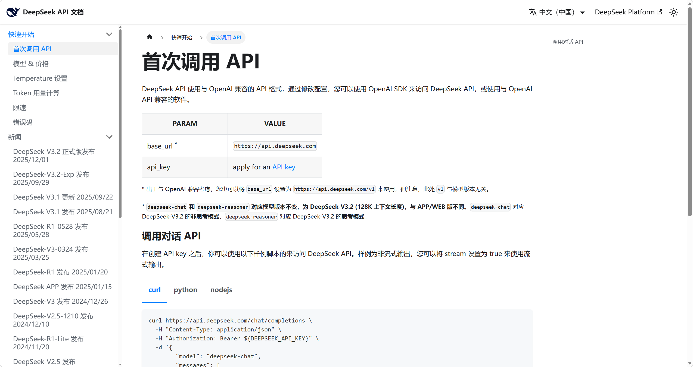
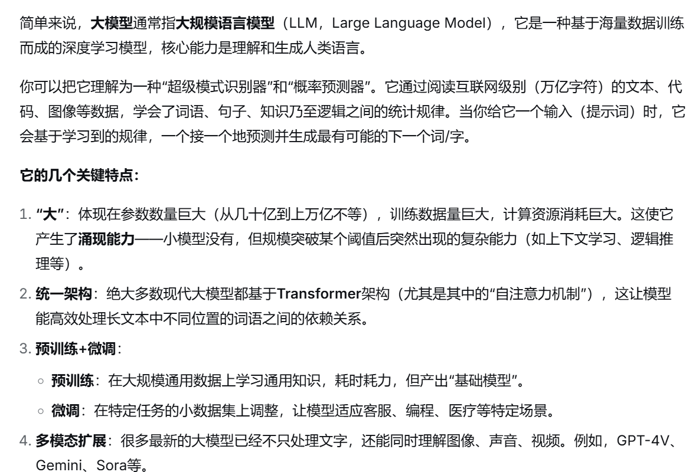

## 认识LangChain
 **LangChain**: 是连接AI模型与实际AI应用(智能客服（聊天类），DS、豆包等（生成类）)的“桥梁”之一

AI模型 ----桥梁---- AI应用
**淌水过河**
用大模型的原生接口：如deepseek的api接口

如果淌水过去，会遇到很多问题

**桥梁**
如LangChain就可以帮助我们优化流程，封装内容，让我们能更好的调用大模型

**宏观认识大模型**：
- 数字巨人
- 大脑

deepseek的回答

**核心问题**
如何让大模型不仅是一个百科全书，而是成为一个能**行动**，能**思考**，能融入我们**业务流程**的智能伙伴（agent）？

大模型相当于一个大脑，我们要为他拥有眼睛（查看实时信息）、手脚（用来感知世界）、记忆

LangChain：让大模型拥有眼睛（查看实时信息）、手脚（用来感知世界）、记忆，能让我们更好的使用AI模型