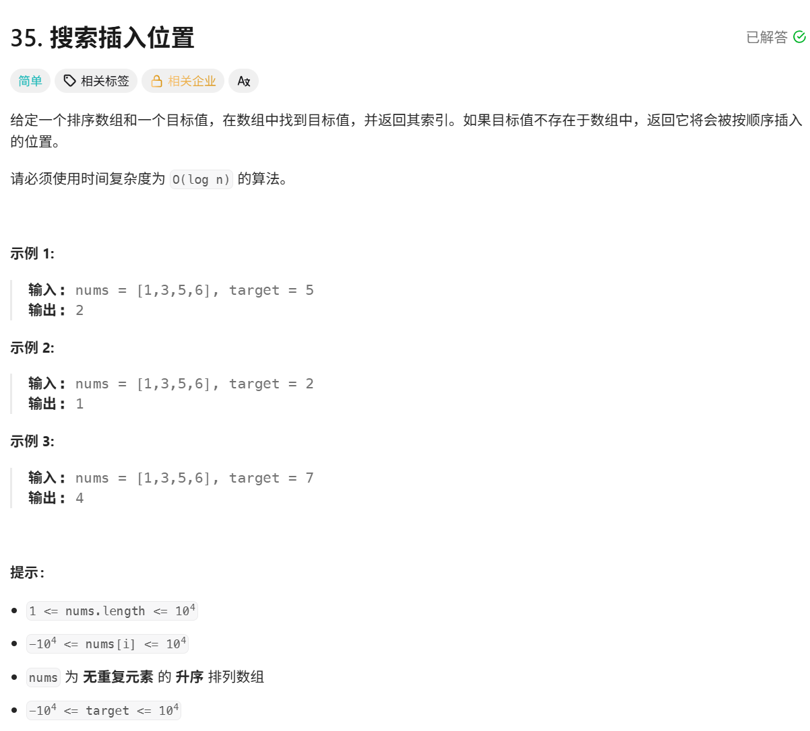
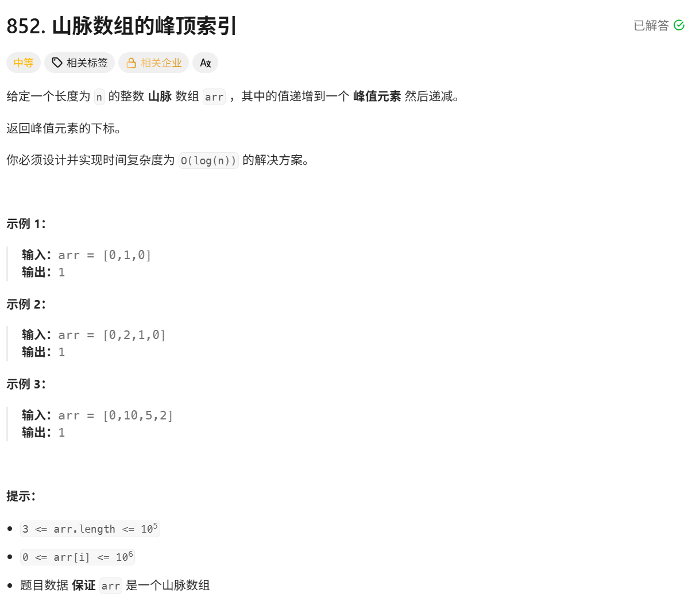
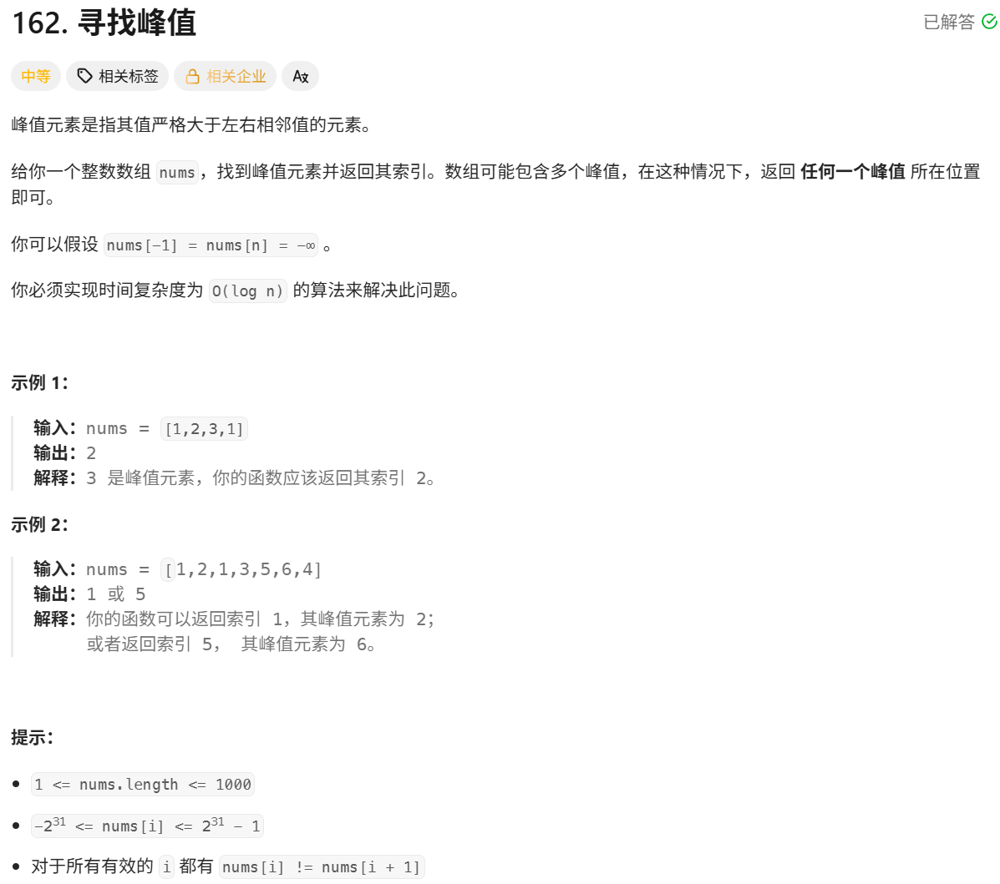
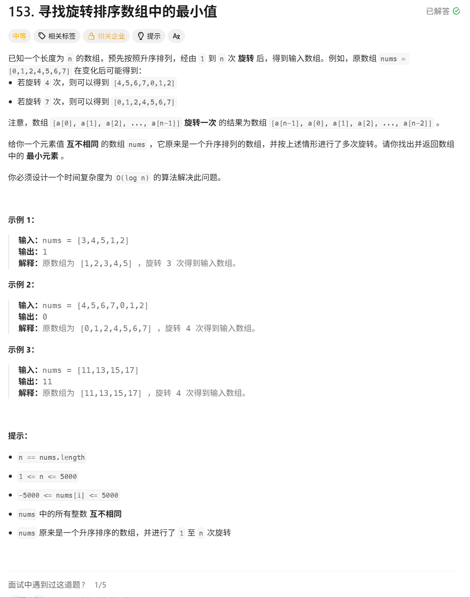

## 二分查找
**特点**: 细节最多，最容易写出死循环的算法，但是当处理好细节后也是最简单的算法

**学习的侧重点**
1. 算法原理：
	 - 并不是只有在数组有序的情况下能用，只要数组符合一定规律即可
2. 模板
	- 不要死记硬背->先理解后记忆
	- 朴素的二分模板->最简单->有局限性
	- 查找左边界的二分模板->万能->细节多
	- 查找右边界的二分模板->万能->细节多


**二段性**：当一个规律能选取某个点，将数组分成两部分，能根据规律舍弃一部分，然后在另一部分继续查找的时候，就可以使用二分查找 

**朴素二分法模板**：
```C++
while(left<=right) // 这里的结束条件是left<=right

        {

            int mid=left+(right-left)/2; // 防溢出的写法，或者是left+(right-left+1)/2 这两种都可以，加不加1只会影响偶数个数的时候，中间值指向右边还是左边，都是正确的
            if(...) // ...是需要根据二段性填充的

                left=mid+1;

            else if(...)

                right =mid-1;

            else

                return ...;

        }
```

**查找区间左端点模板:**

```C++
        while(left<right)
        {
            int mid=left+(right-left)/2;
            if(...) right=mid;
            else left=mid+1;
        }
```

**查找区间右端点模板:**
```C++
        while(left<right)
        {
            int mid=left+(right-left+1)/2;
            if(...) left=mid;
            else right=mid-1;
        }
```

- 下面出现-1时，上面就+1
- 分类讨论的代码，就题论题即可

### 二分查找
题目链接：[二分查找](https://leetcode.cn/problems/binary-search/)


**暴力解法**
	O(n) 用一个指针从左往右进行遍历，遇到目标值即可返回

**二分查找**

	在使用二分查找的时候，选二分之一，三分之一，四分之一，五分之一处的点，只要能将数组分为两部分，有二段性都是可以的。但是从概率学的数学期望来说，二分之一的点是最好的

朴素二分法：
- 当x< t -> left = mid + 1 -> \[left,right\]
- 当x> t -> right = mid - 1 -> \[left,right\]
- 当x == t ->返回结果

**细节问题**：
1. 循环结束的条件：
		left\<right
		因为当left与right指向同一个位置的时候，也要进行判断，之前是一次排除一片区域
2. 为什么是正确的
		本质上就是在暴力枚举的基础上，利用二段性，一次排除一片区域的数值，而暴力枚举的时间复杂度差在一次只能排除一个数
3. 时间复杂度
		x次-> 1 -> n/2^x -> 2^x=n -> x=log N
		在算法学习中，logN的算法并不常见，二分查找就是其中之一


```C++
class Solution {

public:

    int search(vector<int>& nums, int target) {

        int left=0,right=nums.size()-1;

        while(left<=right)

        {

            int mid=left+(right-left)/2; // 防止数据溢出

            if(nums[mid]<target) left=mid+1;

            else if(nums[mid]>target) right =mid-1;

            else return mid;

        }

        return -1;

    }

};
```


### 在排序数组中查找元素的第一个和最后一个位置
题目链接：[leetcode:34 在排序数组中查找元素的第一个和最后一个位置](https://leetcode.cn/problems/find-first-and-last-position-of-element-in-sorted-array/)

**算法思路:**

用的还是二分思想，就是根据数据的性质，在某种判断条件下将区间一分为二，然后舍去其中一个区间，然后再另一个区间内查找；

方便叙述，用 x 表示该元素，resLeft 表示左边界，resRight 表示右边界。

**寻找左边界思路:**

**寻找左边界:**

我们注意到以左边界划分的两个区间的特点:

- 左边区间 \[left,resLeft−1] 都是小于 x 的；
- 右边区间（包括左边界）\[resLeft,right] 都是大于等于 x 的；

因此，关于 mid 的落点，我们可以分为下面两种情况:

- 当我们的 mid 落在 \[left,resLeft−1] 区间的时候，也就是 arr\[mid]<target。说明 \[left,mid] 都是可以舍去的，此时更新 left 到 mid+1 的位置，继续在 \[mid+1,right] 上寻找左边界；
- arr\[mid]\<targrt -> left=mid+1 -> \[left,right]
- 当 mid 落在 \[resLeft,right] 的区间的时候，也就是 arr\[mid]>=target。说明 \[mid+1,right]（因为 mid 可能是最终结果，不能舍去）是可以舍去的，此时更新 right 到 mid 的位置，继续在 \[left,mid] 上寻找左边界；
- arr\[mid]\>=targrt -> right=mid -> \[left,right]

由此，就可以通过二分，来快速寻找左边界；

**注意:**

这里找中间元素需要向下取整。

因为后续移动左右指针的时候:

- 左指针：left=mid+1，是会向后移动的，因此区间是会缩小的；
- 右指针：right=mid，可能会原地踏步（比如：如果向上取整的话，如果剩下 1,2 两个元素，left==1，right==2，mid==2。更新区间之后，left,right,mid 的值没有改变，就会陷入死循环）。

因此一定要注意，当 right=mid 的时候，要向下取整。
在最后两个点时，一定要让mid落在包含范围外的那个需要判断的点，而不是已经确实是目标值的点，也就是左边的点

**寻找右边界思路:**

**寻右左边界:**

用 resRight 表示右边界；

我们注意到右边界的特点:

- 左边区间（包括右边界）\[left,resRight] 都是小于等于 x 的；
- 右边区间 \[resRight+1,right] 都是大于 x 的；

因此，关于 mid 的落点，我们可以分为下面两种情况:

- 当我们的 mid 落在 \[left,resRight] 区间的时候，说明 \[left,mid−1]（mid 不可以舍去，因为有可能是最终结果）都是可以舍去的，此时更新 left 到 mid 的位置；
- arr\[mid]\<=targrt -> left=mid -> \[left,right]
- 当 mid 落在 \[resRight+1,right] 的区间的时候，说明 \[mid,right] 内的元素是可以舍去的，此时更新 right 到 mid−1 的位置；
- arr\[mid]\>targrt -> right=mid-1 -> \[left,right]

由此，就可以通过二分，来快速寻找右边界；

**注意:**

这里找中间元素需要向上取整。

因为后续移动左右指针的时候:

- 左指针：left=mid，可能会原地踏步（比如：如果向下取整的话，如果剩下 1,2 两个元素，left==1，right==2，mid==1。更新区间之后，left,right,mid 的值没有改变，就会陷入死循环）。
- 右指针：right=mid−1，是会向前移动的，因此区间是会缩小的；

因此一定要注意，当 right=mid 的时候，要向下取整。
在最后两个点时，一定要让mid落在包含范围外的那个需要判断的点，而不是已经确实是目标值的点，也就是右边的点

**二分查找算法总结:**

请大家一定不要觉得背下模板就能解决所有二分问题。二分问题最重要的就是要分析题意，然后确定要搜索的区间，根据分析问题来写出二分查找算法的代码。

要分析题意，确定搜索区间，不要死记模板，不要看左闭右开什么乱七八糟的题解

要分析题意，确定搜索区间，不要死记模板，不要看左闭右开什么乱七八糟的题解

要分析题意，确定搜索区间，不要死记模板，不要看左闭右开什么乱七八糟的题解

重要的事情说三遍。

**模板记忆技巧:**

1. 关于什么时候用三段式，还是二段式中的某一个，一定不要强行去用，而是通过具体的问题分析情况，根据查找区间的变化确定指针的转移过程，从而选择一个模板。
2. 当选择两段式的模板时:
    
    在求 mid 的时候，只有 right−1 的情况下，才会向上取整（也就是 +1 取中间数）


```C++
class Solution {

public:

    vector<int> searchRange(vector<int>& nums, int target) {

        int left=0,right=nums.size()-1;

        vector<int> ret={-1,-1};

        if(nums.empty()) return ret;

        while(left<right)

        {

            int mid=left+(right-left)/2;

            if(nums[mid]>=target) right=mid;

            else left=mid+1;

        }

        if(nums[left]==target) ret[0]=left;

        else return ret;

        left=0,right=nums.size()-1; // 其实这里也可以优化为left不动，right重置，因为left可以从左端点开始找

        while(left<right)

        {

            int mid=left+(right-left+1)/2;

            if(nums[mid]<=target) left=mid;

            else right=mid-1;

        }

        if(nums[left]==target) ret[1]=left;

        return ret;

    }

};
```


### x 的平方根
题目链接：[Leetcode:69 x 的平方根](https://leetcode.cn/problems/sqrtx/)


**解法一（暴力查找）：**

**算法思路:**
依次枚举 \[0,x] 之间的所有数 i：
(这里没有必要研究是否枚举到 x/2 还是 x/2+1。因为我们找到结果之后直接就返回了，往后的情况就不会再判断。反而研究枚举区间，既耽误时间，又可能出错)

- 如果 i∗i==x，直接返回 x；
- 如果 i∗i>x，说明之前的一个数是结果，返回 i−1。

由于 i∗i 可能超过 int 的最大值，因此使用 long long 类型。

**解法二（二分查找算法）：**
**算法思路:**

设 x 的平方根的最终结果为 index：

**a. 分析 index 左右两次数据的特点：**

- \[0,index] 之间的元素，平方之后都是小于等于 x 的；
- \[index+1,x] 之间的元素，平方之后都是大于 x 的。

因此可以使用二分查找算法。

```C++
class Solution {

public:

    int mySqrt(int x) {

        long long left =0 ,right=x;

        while(left<right)

        {

            long long mid=left+(right-left+1)/2; //注意数据范围大小

            if(mid*mid<=x) left=mid;

            else right=mid-1;

        }

        return left;

    }

};
```


### 搜索插入位置
题目链接：[35. 搜索插入位置](https://leetcode.cn/problems/search-insert-position/)


**解法（二分查找算法）**
**算法思路**

** a. 分析插入位置左右两侧区间上元素的特点**

设插入位置的坐标为 `index`，根据插入位置的特点可以知道：

- `[left, index - 1]` 内的所有元素均是**小于** `target` 的；
- `[index, right]` 内的所有元素均是**大于等于** `target` 的。

---

**b. 设 `left` 为本轮查询的左边界，`right` 为本轮查询的右边界。根据 `mid` 位置元素的信息，分析下一轮查询的区间**

- 当 `nums[mid] >= target` 时，说明 `mid` 落在了 `[index, right]` 区间上，`mid` 左边包括 `mid` 本身，可能是最终结果，所以接下来查找的区间在 `[left, mid]` 上。因此，更新 `right` 到 `mid` 位置，继续查找。
- 当 `nums[mid] < target` 时，说明 `mid` 落在了 `[left, index - 1]` 区间上，`mid` 右边但不包括 `mid` 本身，可能是最终结果，所以接下来查找的区间在 `[mid + 1, right]` 上。因此，更新 `left` 到 `mid + 1` 的位置，继续查找。

---

**c. 终止条件**

直到查找区间的长度变为 1，也就是 `left == right` 的时候，`left` 或者 `right` 所在的位置就是要找的结果。

```C++
class Solution {

public:

    int searchInsert(vector<int>& nums, int target) {

        int left=0,right=nums.size()-1;

        while(left<right)

        {

            int mid=left+(right-left)/2;

            if(nums[mid]<target) left=mid+1;

            else right = mid;

        }

        if(nums[left]<target) return left+1;

        return left;

    }

};
```


### 山脉数组的峰顶索引
题目链接：[852. 山脉数组的峰顶索引](https://leetcode.cn/problems/peak-index-in-a-mountain-array/)

**解法一（暴力查找）**

**算法思路：**

峰顶的特点：比两侧的元素都要大。

因此，我们可以遍历数组内的每一个元素，找到某一个元素比两边的元素大即可。

---

**解法二（二分查找）**

**算法思路：**

1. **分析峰顶位置的数据特点，以及山峰两旁的数据的特点：**
    
    - 峰顶数据特点：`arr[i] > arr[i - 1] && arr[i] > arr[i + 1]`；
    - 峰顶左边的数据特点：`arr[i] > arr[i - 1] && arr[i] < arr[i + 1]`，也就是呈现上升趋势；
    - 峰顶右边数据的特点：`arr[i] < arr[i - 1] && arr[i] > arr[i + 1]`，也就是呈现下降趋势。
    
2. **因此，根据 `mid` 位置的信息，我们可以分为下面三种情况：**
    
    - 如果 `mid` 位置呈现上升趋势，说明我们接下来要在 `[mid + 1, right]` 区间继续搜索；
    - 如果 `mid` 位置呈现下降趋势，说明我们接下来要在 `[left, mid - 1]` 区间搜索；
    - 如果 `mid` 位置就是山峰，直接返回结果。


```C++
class Solution {

public:

    int peakIndexInMountainArray(vector<int>& arr) {

        int left=1,right=arr.size()-2;

        while(left<right)

        {

            int mid=left+(right-left+1)/2;

            if(arr[mid]>arr[mid-1]) left=mid;

            else right=mid-1;

        }

        return left;

    }

};
```


### 寻找峰值
题目链接：[162. 寻找峰值](https://leetcode.cn/problems/find-peak-element/)


**解法二（二分查找算法）**

**算法思路：**

**寻找二段性：**

任取一个点 `i`，与下一个点 `i + 1`，会有如下两种情况：

- `arr[i] > arr[i + 1]`：此时「左侧区域」一定会存在山峰（因为最左侧是负无穷），那么我们可以去左侧去寻找结果；
- `arr[i] < arr[i + 1]`：此时「右侧区域」一定会存在山峰（因为最右侧是负无穷），那么我们可以去右侧去寻找结果。

当我们找到「二段性」的时候，就可以尝试用「二分查找」算法来解决问题。

```C++
class Solution {

public:

    int findPeakElement(vector<int>& nums) {

        int left=0,right = nums.size()-1;

        while(left<right)

        {

            int mid=left+(right-left)/2;

            if(nums[mid]<nums[mid+1]) left=mid+1;

            else right=mid;

        }

        return left;

    }

};
```


### 寻找旋转排序数组中的最小值
题目链接：[153. 寻找旋转排序数组中的最小值](https://leetcode.cn/problems/find-minimum-in-rotated-sorted-array/)



关于暴力查找，只需遍历一遍数组，这里不再赘述。

**解法（二分查找）：**

**算法思路：**

题目中的数组规则如下图所示：

其中 C 点就是我们要求的点。

二分的本质：找到一个判断标准，使得查找区间能够一分为二。

通过图像我们可以发现，`[A, B]` 区间内的点都是严格大于 D 点的值的，C 点的值是严格小于 D 点的值的。但是当 `[C, D]` 区间只有一个元素的时候，C 点的值是可能等于 D 点的值的。

因此，初始化左右两个指针 `left`，`right`：

然后根据 `mid` 的落点，我们可以这样划分下一次查询的区间：

- 当 `mid` 在 `[A, B]` 区间的时候，也就是 `mid` 位置的值严格大于 D 点的值，下一次查询区间在 `[mid + 1, right]` 上；
- 当 `mid` 在 `[C, D]` 区间的时候，也就是 `mid` 位置的值严格小于等于 D 点的值，下次查询区间在 `[left, mid]` 上。

当区间长度变成 1 的时候，就是我们要找的结果。

```C++
class Solution {

public:

    int findMin(vector<int>& nums) {

        int left=0,right=nums.size()-1,target=nums.back();

        while(left<right)

        {

            int mid=left+(right-left)/2;

            if(nums[mid]<target) right=mid;

            else left=mid+1;

        }

        return nums[left];

    }

};
```

