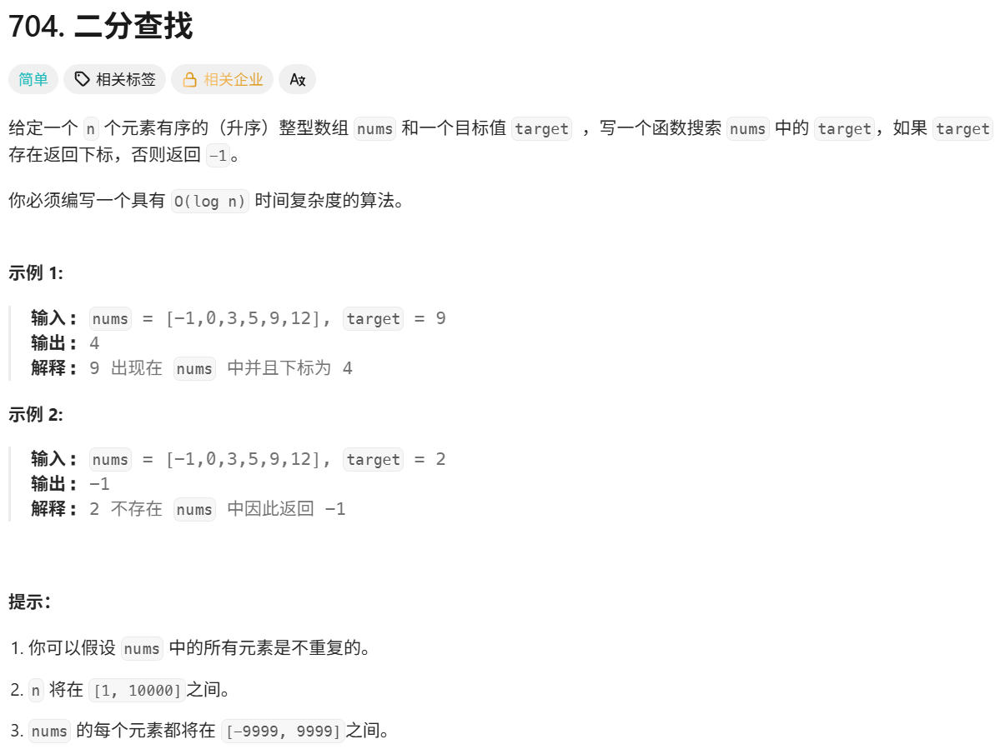
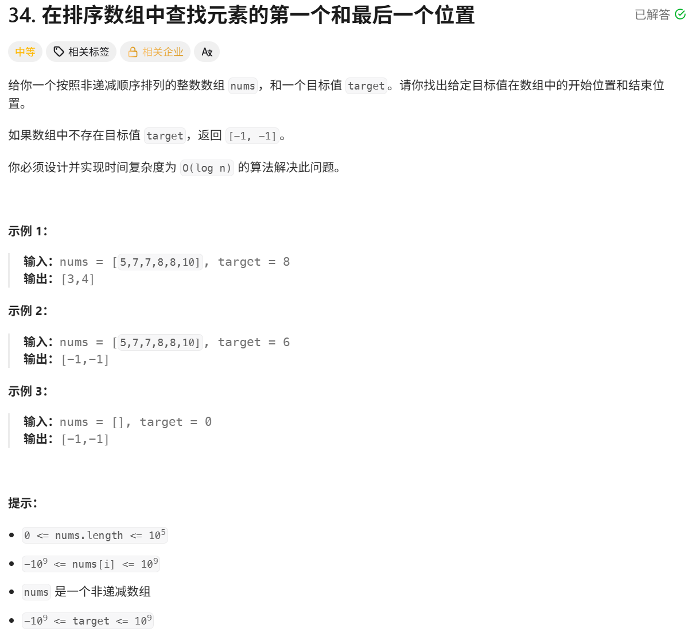

## 二分查找
**特点**: 细节最多，最容易写出死循环的算法，但是当处理好细节后也是最简单的算法

**学习的侧重点**
1. 算法原理：
	 - 并不是只有在数组有序的情况下能用，只要数组符合一定规律即可
2. 模板
	- 不要死记硬背->先理解后记忆
	- 朴素的二分模板->最简单->有局限性
	- 查找左边界的二分模板->万能->细节多
	- 查找右边界的二分模板->万能->细节多


**二段性**：当一个规律能选取某个点，将数组分成两部分，能根据规律舍弃一部分，然后在另一部分继续查找的时候，就可以使用二分查找 

**朴素二分法模板**：
```C++
while(left<=right) // 这里的结束条件是left<=right

        {

            int mid=left+(right-left)/2; // 防溢出的写法，或者是left+(right-left+1)/2 这两种都可以，加不加1只会影响偶数个数的时候，中间值指向右边还是左边，都是正确的
            if(...) // ...是需要根据二段性填充的

                left=mid+1;

            else if(...)

                right =mid-1;

            else

                return ...;

        }
```

### 二分查找
题目链接：[二分查找](https://leetcode.cn/problems/binary-search/)



**暴力解法**
	O(n) 用一个指针从左往右进行遍历，遇到目标值即可返回

**二分查找**

	在使用二分查找的时候，选二分之一，三分之一，四分之一，五分之一处的点，只要能将数组分为两部分，有二段性都是可以的。但是从概率学的数学期望来说，二分之一的点是最好的

朴素二分法：
- 当x< t -> left = mid + 1 -> \[left,right\]
- 当x> t -> right = mid - 1 -> \[left,right\]
- 当x == t ->返回结果

**细节问题**：
1. 循环结束的条件：
		left\<right
		因为当left与right指向同一个位置的时候，也要进行判断，之前是一次排除一片区域
2. 为什么是正确的
		本质上就是在暴力枚举的基础上，利用二段性，一次排除一片区域的数值，而暴力枚举的时间复杂度差在一次只能排除一个数
3. 时间复杂度
		x次-> 1 -> n/2^x -> 2^x=n -> x=log N
		在算法学习中，logN的算法并不常见，二分查找就是其中之一


```C++
class Solution {

public:

    int search(vector<int>& nums, int target) {

        int left=0,right=nums.size()-1;

        while(left<=right)

        {

            int mid=left+(right-left)/2; // 防止数据溢出

            if(nums[mid]<target) left=mid+1;

            else if(nums[mid]>target) right =mid-1;

            else return mid;

        }

        return -1;

    }

};
```


### 在排序数组中查找元素的第一个和最后一个位置
题目链接：[leetcode:34 在排序数组中查找元素的第一个和最后一个位置](https://leetcode.cn/problems/find-first-and-last-position-of-element-in-sorted-array/)



```C++
class Solution {

public:

    vector<int> searchRange(vector<int>& nums, int target) {

        int left=0,right=nums.size()-1;

        vector<int> ret={-1,-1};

        if(nums.empty()) return ret;

        while(left<right)

        {

            int mid=left+(right-left)/2;

            if(nums[mid]>=target) right=mid;

            else left=mid+1;

        }

        if(nums[left]==target) ret[0]=left;

        else return ret;

        left=0,right=nums.size()-1; // 其实这里也可以优化为left不动，right重置，因为left可以从左端点开始找

        while(left<right)

        {

            int mid=left+(right-left+1)/2;

            if(nums[mid]<=target) left=mid;

            else right=mid-1;

        }

        if(nums[left]==target) ret[1]=left;

        return ret;

    }

};
```