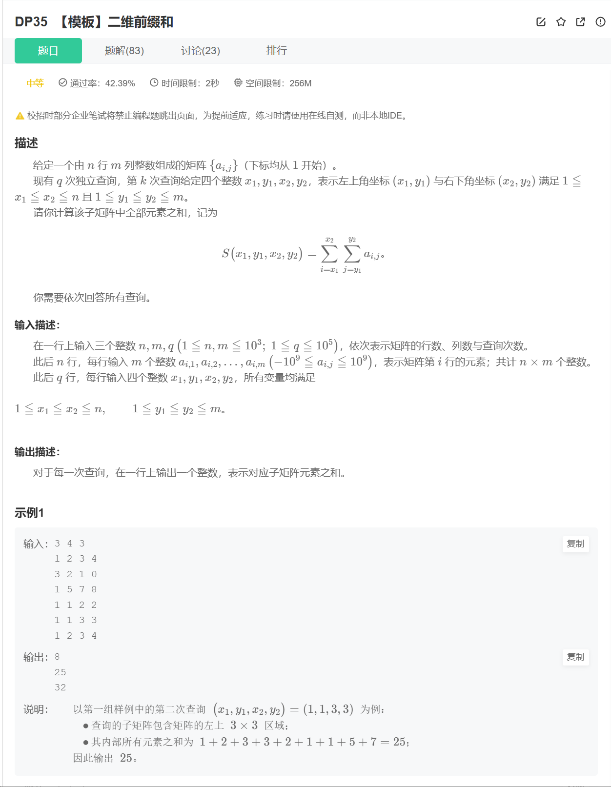
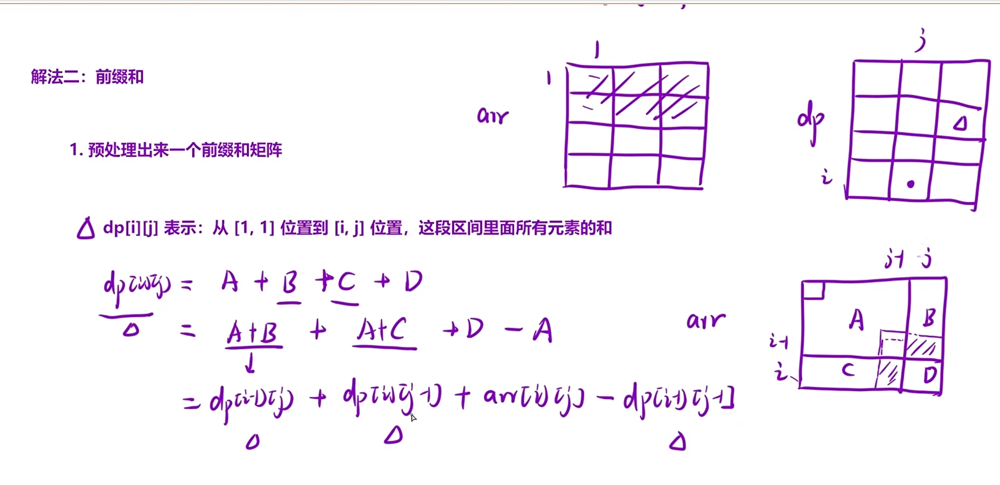
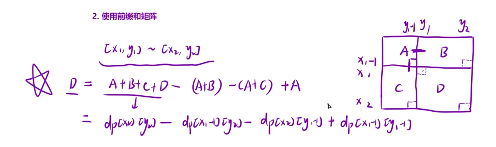

## 前缀和

### DP34 【模板】前缀和
题目链接：[DP34 【模板】前缀和](https://www.nowcoder.com/share/jump/2847152901776218551041)

**解法（前缀和）：**

**算法思路**：

a. 先预处理出来一个「前缀和」数组：

用 `dp[i]` 表示：`[1, i]` 区间内所有元素的和，那么 `dp[i - 1]` 里面存的就是 `[1, i - 1]` 区间内所有元素的和，那么：可得递推公式：`dp[i] = dp[i - 1] + arr[i]`；

b. 使用前缀和数组，「快速」求出「某一个区间内」所有元素的和：

当询问的区间是 `[l, r]` 时：区间内所有元素的和为：`dp[r] - dp[l - 1]`。
因为本质上求1-5区间和1-2区间和是同一类问题
dp数组中，每个值的含义很重要


```C++
#include <cstdio>
#include <vector>
#include <iostream>

using namespace std;
int main() {
    int n, m;
    cin >> n >> m;
    vector<int> arr(n+1);
    vector<long long> dp(n+1);
    for(int i=1;i<=n;i++) cin>>arr[i];
    for(int i=1;i<=n;i++) dp[i]=dp[i-1]+arr[i];
    int l=0,r=0;
    while(m--)
    {
        cin>>l>>r;
        cout<<dp[r]-dp[l-1]<<endl;
    }
    return 0;
}
```


### DP35 【模板】二维前缀和
题目链接：[DP35 【模板】二维前缀和](https://www.nowcoder.com/share/jump/2847152901776221063326)




**解法**

**算法思路：**

类比于一维数组的形式，如果我们能处理出来从 [0,0] 位置到 [i,j] 位置这片区域内所有元素的累加和，就可以在 O(1) 的时间内，搞定矩阵内任意区域内所有元素的累加和。因此我们接下来仅需完成两步即可：

**第一步：搞出来前缀和矩阵**

这里就要用到一维数组里面的拓展知识，我们要在矩阵的最上面和最左边添加上一行和一列 0，这样我们就可以省去非常多的边界条件的处理。处理后的矩阵：

原矩阵：

|1|2|3|
|---|---|---|
|4|5|6|
|7|8|9|

处理后前缀和矩阵：

| 0   | 0   | 0   | 0   |
| --- | --- | --- | --- |
| 0   | 1   | 2   | 3   |
| 0   | 4   | 5   | 6   |
| 0   | 7   | 8   | 9   |

这样，我们填写前缀和矩阵数组的时候，下标直接从 1 开始，能大胆使用 i−1,j−1 位置的值。

**注意 dp 表与原数组 matrix 内的元素的映射关系：**

i. 从 dp 表到 matrix 矩阵，横纵坐标减一；

ii. 从 matrix 矩阵到 dp 表，横纵坐标加一。

前缀和矩阵中 sum [i][j] 的含义，以及如何递推二维前缀和方程

**a. sum [i][j] 的含义：**

sum [i][j] 表示，从 [0,0] 位置到 [i,j] 位置这段区域内，所有元素的累加和。

**a. 递推方程：**

其实这个递推方程非常像我们小学做过求图形面积的题，我们可以将 [0,0] 位置到 [i,j] 位置这段区域分解成下面的部分：

sum [i][j] = 红 + 蓝 + 绿 + 黄，分析一下这四块区域：

i. 黄色部分最简单，它就是数组中的 matrix [i - 1][j - 1] (注意坐标的映射关系)

ii. 单独的蓝不好求，因为它不是我们定义的状态表示中的区域，同理，单独的绿也是；

iii. 但是如果是红 + 蓝，正好是我们 dp 数组中 sum [i - 1][j] 的值；

iv. 同理，如果是红 + 绿，正好是我们 dp 数组中 sum [i][j - 1] 的值；

v. 如果把上面求的三个值加起来，那就是黄 + 红 + 蓝 + 红 + 绿，发现多算了一部分红的面积，因此再单独减去红的面积即可；

vi. 红的面积正好也是符合 dp 数组的定义的，即 sum [i - 1][j - 1]

**综上所述，我们的递推方程就是：**

`sum[i][j] = sum[i - 1][j] + sum[i][j - 1] - sum[i - 1][j - 1] + matrix[i - 1][j - 1];`

**第二步：使用前缀和矩阵**

题目的接口中提供的参数是原始矩阵的下标，为了避免下标映射错误，这里直接先把下标映射成 dp 表里面对应的下标：`row1++, col1++, row2++, col2++`

接下来分析如何使用这个前缀和矩阵，注意这里的 row 和 col 都处理过了，对应的正是 sum 矩阵中的下标：

对于左上角 (row1, col1)、右下角 (row2, col2) 围成的区域，正好是红色的部分。因此我们要求的就是红色部分的面积，继续分析几个区域：

i. 黄色，能直接求出来，就是 sum [row1 - 1, col1 - 1] (为什么减一？因为要剔除掉 row 这一行和 col 这一列)

ii. 绿色，直接求不好求，但是和黄色拼起来，正好是 sum 表内 sum [row1 - 1][col2] 的数据；

iii. 同理，蓝色不好求，但是 蓝 + 黄 = sum [row2][col1 - 1]；

iv. 再看看整个面积，好求嘛？非常好求，正好是 sum [row2][col2]；

v. 那么，红色就 = 整个面积 - 黄 - 绿 - 蓝，但是绿蓝不好求，我们可以这样减：整个面积 - (绿 + 黄) - (蓝 + 黄)，这样相当于多减去了一个黄，再加上即可。

**综上所述：红 = 整个面积 - (绿 + 黄) - (蓝 + 黄) + 黄，从而可得红色区域内的元素总和为：**

`sum[row2][col2] - sum[row2][col1 - 1] - sum[row1 - 1][col2] + sum[row1 - 1][col1 - 1]`


```C++
#include <iostream>
#include <vector>

using namespace std;

int main() {

   int n=0,m=0,q=0;
   cin>>n>>m>>q;
   vector<vector<long long>> arr(n+1,vector<long long>(m+1,0));
   vector<vector<long long>> dp(n+1,vector<long long>(m+1,0));

   for(int i=1;i<=n;i++)
        for(int j=1;j<=m;j++)
            cin>>arr[i][j];
   for(int i=1;i<=n;i++)
        for(int j=1;j<=m;j++)
            dp[i][j]=dp[i-1][j]+dp[i][j-1]-dp[i-1][j-1]+arr[i][j];
   int x1=0,x2=0,y1=0,y2=0;
   while(q--)

   {
        cin>>x1>>y1>>x2>>y2;
        cout<<dp[x2][y2]-dp[x2][y1-1]-dp[x1-1][y2]+dp[x1-1][y1-1]<<endl;
   }
   return 0;

}
```


