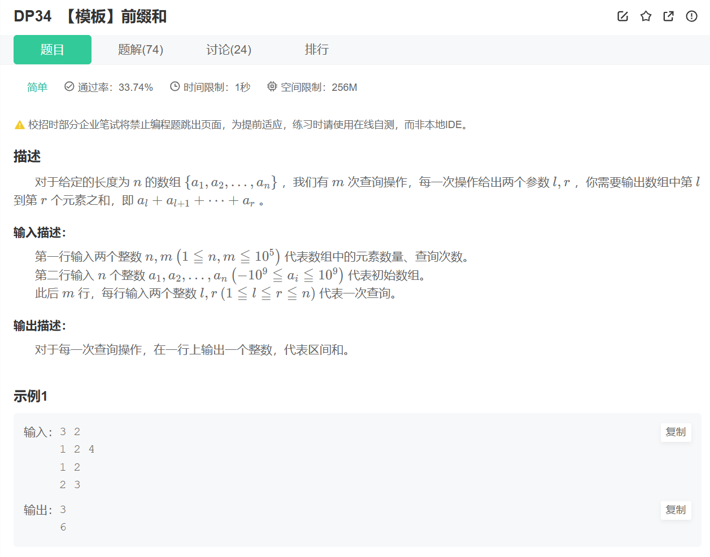
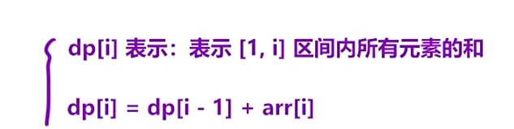

## 前缀和

### DP34 【模板】前缀和
题目链接：[DP34 【模板】前缀和](https://www.nowcoder.com/share/jump/2847152901776218551041)

**解法（前缀和）：**

**算法思路**：

a. 先预处理出来一个「前缀和」数组：

用 `dp[i]` 表示：`[1, i]` 区间内所有元素的和，那么 `dp[i - 1]` 里面存的就是 `[1, i - 1]` 区间内所有元素的和，那么：可得递推公式：`dp[i] = dp[i - 1] + arr[i]`；

b. 使用前缀和数组，「快速」求出「某一个区间内」所有元素的和：

当询问的区间是 `[l, r]` 时：区间内所有元素的和为：`dp[r] - dp[l - 1]`。
因为本质上求1-5区间和1-2区间和是同一类问题


```C++
#include <cstdio>
#include <vector>
#include <iostream>

using namespace std;
int main() {
    int n, m;
    cin >> n >> m;
    vector<int> arr(n+1);
    vector<long long> dp(n+1);
    for(int i=1;i<=n;i++) cin>>arr[i];
    for(int i=1;i<=n;i++) dp[i]=dp[i-1]+arr[i];
    int l=0,r=0;
    while(m--)
    {
        cin>>l>>r;
        cout<<dp[r]-dp[l-1]<<endl;

    }

    return 0;

}
```