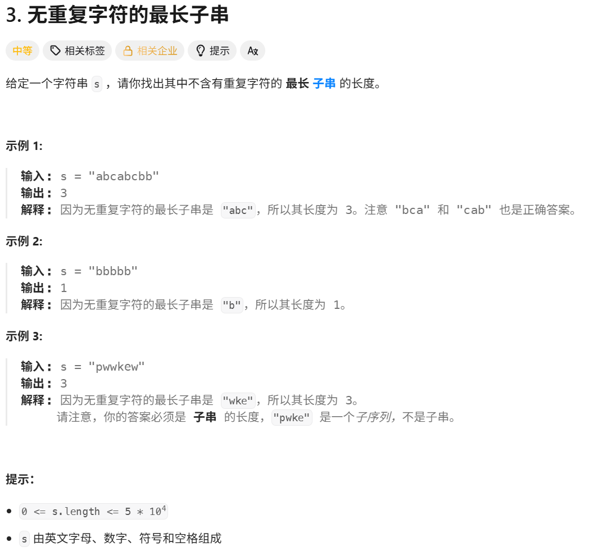
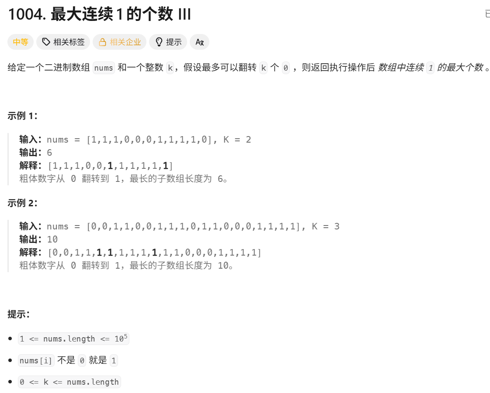
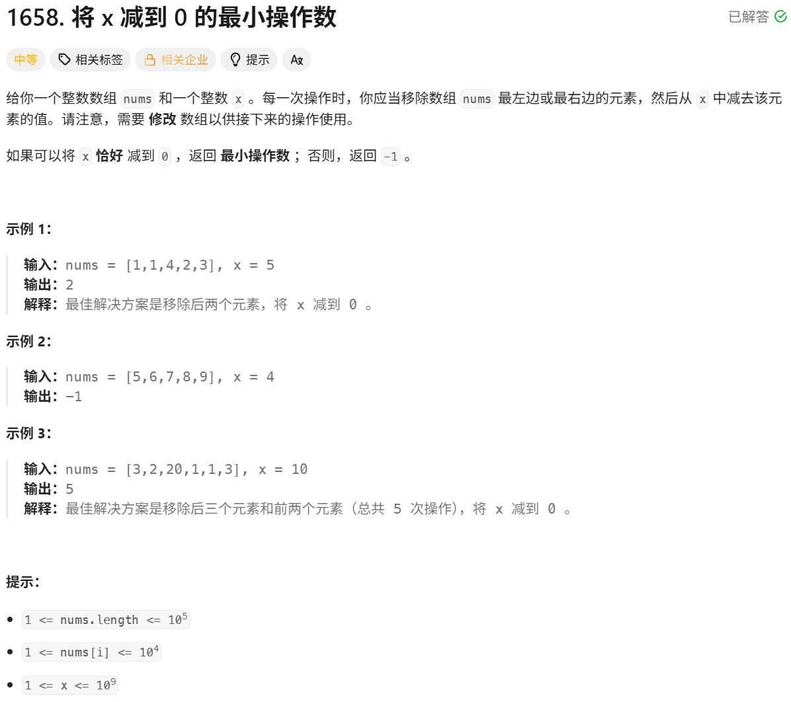
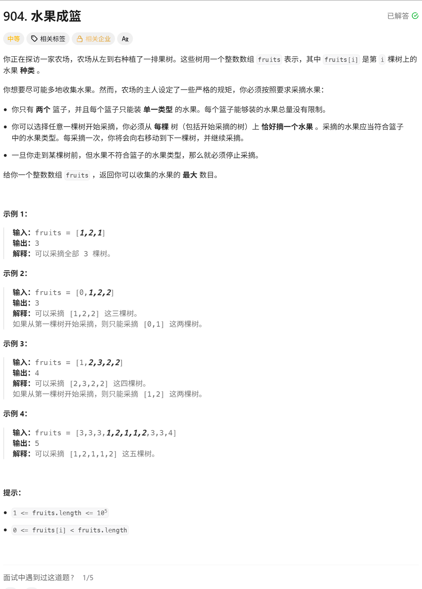

  滑动窗口的本质就是利用单调性，使用“同向双指针”来优化算法

> 用法：
> 	- left = 0 right = 0
> 	- 进窗口
> 	- 判断
> 		- 出窗口
> 	 更新结果
> 更新结果这一步可能是在判断处，可能在进窗口处等，根据题目不同确定


### 长度最小的子数组
题目链接：[209. 长度最小的子数组](https://leetcode.cn/problems/minimum-size-subarray-sum/)


**暴力枚举**
 设置left与right，依次枚举出所有的可能性，并更新结果，在每次运算left与right区间中的值时，都进行遍历累加sum，因此时间复杂度为O(n^3) 

**优化累加，将暴力枚举优化为O(n^2)**
  在暴力枚举的过程中，每次计算left与right区间的和时，不再通过再次遍历的方式计算，而是使用sum进行累加，这样在left与right区间累加的时间复杂度不再是n，而且是常数级

**利用单调性，使用“同向双指针”（滑动窗口）优化**
  由于此问题分析的对象是**⼀段连续的区间**，因此可以考虑**滑动窗口**的思想来解决这道题。 让滑动窗⼝满⾜：
    从 i 位置开始，窗⼝内所有元素的和⼩于 target （那么当窗口内元素之和 第⼀次⼤于等于⽬标值的时候，就是 i 位置开始，满⾜条件的最⼩⻓度）。
 做法：将右端元素划⼊窗⼝中，统计出此时窗口内元素的和： 
 ▪ 如果窗⼝内元素之和⼤于等于 target ：更新结果，并且将左端元素划出去的同时继续判 断是否满⾜条件并更新结果（因为左端元素可能很⼩，划出去之后依旧满⾜条件） 
 ▪ 如果窗⼝内元素之和不满⾜条件： right++ ，另下⼀个元素进⼊窗⼝

**为何滑动窗⼝可以解决问题，并且时间复杂度更低？**
- 这个窗⼝寻找的是：以当前窗口最左侧元素（记为 就是在这道题中，从 left1 ）为基准，符合条件的情况。也 left1 开始，满⾜区间和 sum >= target 时的最右侧（记为 right1 ）能到哪⾥。 
- 我们既然已经找到从 left1 开始的最优的区间，那么就可以⼤胆舍去 果继续像⽅法⼀⼀样，重新开始统计第⼆个元素（ left1 。但是如 left2 ）往后的和，势必会有⼤量重复 的计算（因为我们在求第⼀段区间的时候，已经算出很多元素的和了，这些和是可以在计算 下次区间和的时候⽤上的）。 
- 此时， rigth1 的作⽤就体现出来了，我们只需将 right1 这个元素开始，往后找满足的，因为 left1 可能很⼩。 left1 这个值从 sum 中剔除。从 left2 元素的区间（此时 sum 剔除掉 right1 也有可能是满 left1 之后，依旧满⾜⼤于等于 target ）。这样我们就能省掉⼤量重复的计算
- 这样我们不仅能解决问题，⽽且效率也会⼤⼤提升。 时间复杂度：虽然代码是两层循环，但是我们的 left 指针和 最多都往后移动 n 次。因此时间复杂度是 O(N) 。
```C++
class Solution {

public:

    int minSubArrayLen(int target, vector<int>& nums) {

        int n=nums.size(),sum=0,len=INT_MAX;

        for(int left=0,right=0;right<n;right++)

        {

            sum+=nums[right];

            while(sum>=target)

            {

                len=min(len,right-left+1);

                sum-=nums[left++];

            }

        }

        return len==INT_MAX?0:len;

    }

};
```


### 无重复字符的最长子串
题目链接：[无重复字符的最长子串](https://leetcode.cn/problems/longest-substring-without-repeating-characters/)


**暴力枚举+哈希表查重**
- 可以用左右指针，进行枚举，遇到元素查看哈希表中有没有存在，如果不存在就插入到哈希表中，如果存在就得出结果，并将左指针向右移动


**滑动窗口**
研究的对象依旧是⼀段连续的区间，因此继续使⽤**滑动窗⼝**思想来优化。 让**滑动窗⼝**满⾜：窗⼝内所有元素都是不重复的。 
做法：右端元素 ch 进⼊窗⼝的时候，哈希表统计这个字符的频次： 
- 如果这个字符出现的频次超过 1 ，说明窗⼝内有重复元素，那么就从左侧开始划出窗⼝， 直到 ch 这个元素的频次变为 1 ，然后再更新结果。 
- 如果没有超过 1 ，说明当前窗⼝没有重复元素，可以直接更新结果
- 这里的元素种类只有字母、数字、符号和空白符，所以一个128大小的数组就够了
- 这里的时间复杂度并不是两个循环嵌套的O(n^2),而是实际运行的O(n)，空间复杂度为O(1)
```C++
class Solution {

public:

    int lengthOfLongestSubstring(string s) {

        int len=0,n=s.size();

        int left=0,right=0;

        int hash[128]={0};

        while(right<n)

        {

            hash[s[right]]++;

            while(hash[s[right]]>1)

                hash[s[left++]]--;

            len=max(len,right-left+1);

            right++;

        }

        return len;

    }
};
```


### 最大连续1的个数 III
题目链接：[最大连续1的个数 III](https://leetcode.cn/problems/max-consecutive-ones-iii/)

**暴力枚举+zero计数**
暴力枚举就是定left，让right往右走，遇到0，则zero++，直到zero>k，让left++，遇到0，则zero--，直到窗口合法。若zero不大于k，则更新结果

**滑动窗口**
### 算法思路:

不要去想怎么翻转，不要把问题想的很复杂，这道题的结果无非就是一段连续的 1 中间塞了 k 个 0 嘛。

因此，我们可以把问题转化成：求数组中一段最长的连续区间，要求这段区间内 0 的个数不超过 k 个。

既然是连续区间，可以考虑使用「滑动窗口」来解决问题。

### 算法流程:

a. 初始化一个大小为 2 的数组就可以当做哈希表 hash 了；初始化一些变量 left = 0，right = 0，ret = 0；

b. 当 right 小于数组大小的时候，一直下列循环:

i. 让当前元素进入窗口，顺便统计到哈希表中；

ii. 检查 0 的个数是否超标:

- 如果超标，依次让左侧元素滑出窗口，顺便更新哈希表的值，直到 0 的个数恢复正常；
    
    iii. 程序到这里，说明窗口内元素是符合要求的，更新结果；
    
    iv. right++，处理下一个元素；
    
c. 循环结束后，ret 存的就是最终结果。
时间复杂度O(n),空间复杂度O(1)

```C++
class Solution {

public:

    int longestOnes(vector<int>& nums, int k) {

        int len=0;

        for(int left=0,right=0,zero=0;right<nums.size();right++)

        {

            if(nums[right]==0)  zero++;

            while(zero>k)

                if(nums[left++]==0) zero--;

            len=max(len,right-left+1);

        }

        return len;

    }

};
```


### 将 x 减到 0 的最小操作数
题目链接：[将 x 减到 0 的最小操作数](https://leetcode.cn/problems/minimum-operations-to-reduce-x-to-zero/)

### 提取文字

 解法（滑动窗口）：
    
    算法思路：
    
    题目要求的是数组「左端 + 右端」两段连续的、和为 x 的最短数组，信息量稍微多一些，不易理清思路；我们可以转化成求数组内一段连续的、和为 `sum(nums) - x` 的最长数组。此时，就是熟悉的「滑动窗口」问题了。

算法流程：

a. 转化问题：求 `target = sum(nums) - x`。如果 `target < 0`，问题无解；

b. 初始化左右指针 `l = 0`，`r = 0`（滑动窗口区间表示为 `[l, r)`，左右区间是否开闭很重要，必须设定与代码一致），记录当前滑动窗口内数组和的变量 `sum = 0`，记录当前满足条件数组的最大区间长度 `maxLen = -1`；

c. 当 `r` 小于等于数组长度时，一直循环：

	i. 如果 `sum < target`，右移右指针，直至变量和大于等于 `target`，或右指针已经移到头；

	ii. 如果 `sum > target`，右移左指针，直至变量和小于等于 `target`，或左指针已经移到头；

	iii. 如果经过前两步的左右移动使得 `sum == target`，维护满足条件数组的最大长度，并让下个元素进入窗口；

d. 循环结束后，如果 `maxLen` 的值有意义，则计算结果返回；否则，返回 `-1`。
时间复杂度O(n) 空间复杂度O(1)

```C++
class Solution {
public:
    int minOperations(vector<int>& nums, int x) {
        int sum=0,len=-1,n=nums.size();
        int target=0;
        for(auto&num:nums)
        {
            target+=num;
        }
        target-=x;
        if(target<0) return -1;
        for(int left=0,right=0;right<n;right++)
        {
            sum+=nums[right];
            while(sum>target)
            {
                sum-=nums[left++];
            }
            if(sum==target)
                len=max(len,right-left+1);
        }
        if(len==-1)
            return len;
        else return n-len;
    }
};
```


### 水果成篮
题目链接：[水果成篮](https://leetcode.cn/problems/fruit-into-baskets/)


**暴力枚举+哈希**
定义一个left，一个right，每次将right向右移动，并将树的种类加入到哈希中，因为既要维护种类，又要维护加入的数量，所以要用unordered_map<int,int>, 当map 的size大于2的时候，说明窗口不合法了，这个时候将left++，并将对应的map的value--，直到map的size小于等于2，并更新合法窗口的结果

**滑动窗口**
##### 算法思路：

研究的对象是一段连续的区间，可以使用「滑动窗口」思想来解决问题。

让滑动窗口满足：窗口内水果的种类只有两种。

做法：右端水果进入窗口的时候，用哈希表统计这个水果的频次。这个水果进来后，判断哈希表的大小：

- 如果大小超过 2：说明窗口内水果种类超过了两种。那么就从左侧开始依次将水果划出窗口，直到哈希表的大小小于等于 2，然后更新结果；
- 如果没有超过 2，说明当前窗口内水果的种类不超过两种，直接更新结果 `ret`。

##### 算法流程：

a. 初始化哈希表 `hash` 来统计窗口内水果的种类和数量；

b. 初始化变量：左右指针 `left = 0`，`right = 0`，记录结果的变量 `ret = 0`；

c. 当 `right` 小于数组大小的时候，一直执行下列循环：

i. 将当前水果放入哈希表中；

ii. 判断当前水果进来后，哈希表的大小：

- 如果超过 2：
    - 将左侧元素滑出窗口，并且在哈希表中将该元素的频次减一；
    - 如果这个元素的频次减一之后变成了 0，就把该元素从哈希表中删除；
    - 重复上述两个过程，直到哈希表中的大小不超过 2；
        
        iii. 更新结果 `ret`；
        
        iv. `right++`，让下一个元素进入窗口；
        
d. 循环结束后，`ret` 存的就是最终结果。

```C++
class Solution {

public:

    int totalFruit(vector<int>& fruits) {

        unordered_map<int,int> hash;

        int num=0;

        for(int left=0,right=0;right<fruits.size();right++)

        {

            hash[fruits[right]]++;

            while(hash.size()>2)

            {

                hash[fruits[left]]--;

                if(hash[fruits[left]]==0)

                    hash.erase(fruits[left]);

                left++;

            }

            num=max(num,right-left+1);

        }

        return num;

    }

};

// 这里的时间的一部分消耗在了大量的hash的插入与删除，如果想进一步优化，可以根据题目的数据范围，用vector模拟哈希
// 如果数据范围有限，可以用数组模拟哈希表

class Solution {

public:

    int totalFruit(vector<int>& fruits) {

        int hash[100001]={0};

        int num=0,kinds=0;

        for(int left=0,right=0;right<fruits.size();right++)

        {

            if(hash[fruits[right]]==0) kinds++;

            hash[fruits[right]]++;

            while(kinds>2)

            {

                hash[fruits[left]]--;

                if(hash[fruits[left]]==0) kinds--;

                left++;

            }

            num=max(num,right-left+1);

        }

        return num;

    }

};

```

