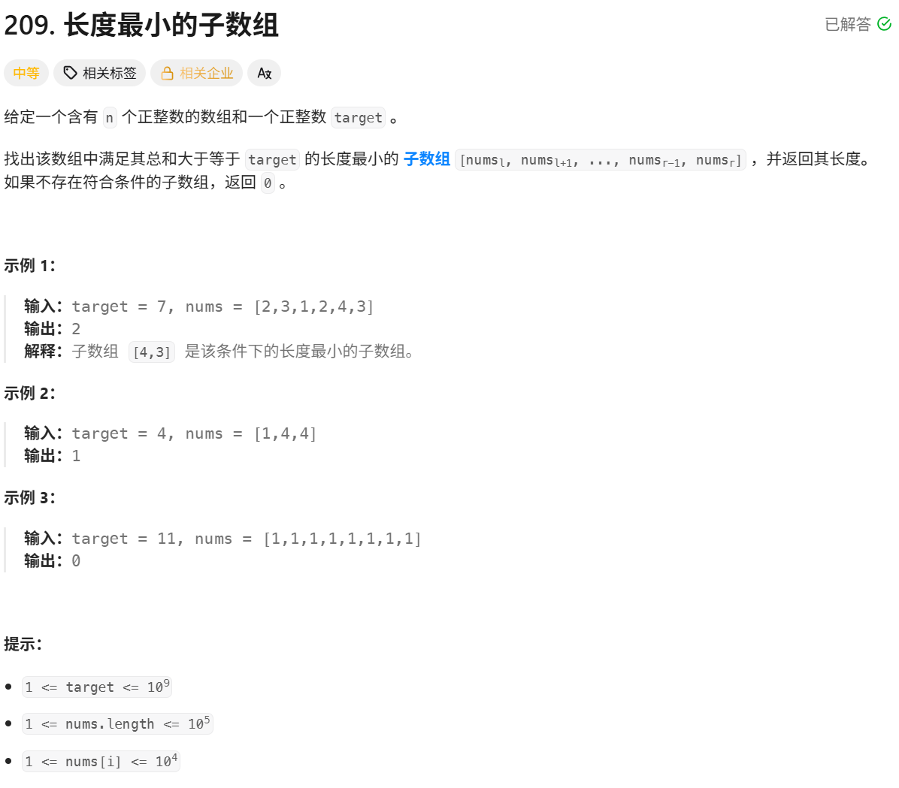

  滑动窗口的本质就是利用单调性，使用“同向双指针”来优化算法

> 用法：
> 	- left = 0 right = 0
> 	- 进窗口
> 	- 判断
> 		- 出窗口
> 	 更新结果
> 更新结果这一步可能是在判断处，可能在进窗口处等，根据题目不同确定


### 长度最小的子数组
题目链接：[209. 长度最小的子数组](https://leetcode.cn/problems/minimum-size-subarray-sum/)



**暴力枚举**
 设置left与right，依次枚举出所有的可能性，并更新结果，在每次运算left与right区间中的值时，都进行遍历累加sum，因此时间复杂度为O(n^3) 

**优化累加，将暴力枚举优化为O(n^2)**
  在暴力枚举的过程中，每次计算left与right区间的和时，不再通过再次遍历的方式计算，而是使用sum进行累加，这样在left与right区间累加的时间复杂度不再是n，而且是常数级

**利用单调性，使用“同向双指针”（滑动窗口）优化**
  由于此问题分析的对象是**⼀段连续的区间**，因此可以考虑**滑动窗口**的思想来解决这道题。 让滑动窗⼝满⾜：
    从 i 位置开始，窗⼝内所有元素的和⼩于 target （那么当窗口内元素之和 第⼀次⼤于等于⽬标值的时候，就是 i 位置开始，满⾜条件的最⼩⻓度）。
 做法：将右端元素划⼊窗⼝中，统计出此时窗口内元素的和： 
 ▪ 如果窗⼝内元素之和⼤于等于 target ：更新结果，并且将左端元素划出去的同时继续判 断是否满⾜条件并更新结果（因为左端元素可能很⼩，划出去之后依旧满⾜条件） 
 ▪ 如果窗⼝内元素之和不满⾜条件： right++ ，另下⼀个元素进⼊窗⼝

**为何滑动窗⼝可以解决问题，并且时间复杂度更低？**
- 这个窗⼝寻找的是：以当前窗口最左侧元素（记为 就是在这道题中，从 left1 ）为基准，符合条件的情况。也 left1 开始，满⾜区间和 sum >= target 时的最右侧（记为 right1 ）能到哪⾥。 
- 我们既然已经找到从 left1 开始的最优的区间，那么就可以⼤胆舍去 果继续像⽅法⼀⼀样，重新开始统计第⼆个元素（ left1 。但是如 left2 ）往后的和，势必会有⼤量重复 的计算（因为我们在求第⼀段区间的时候，已经算出很多元素的和了，这些和是可以在计算 下次区间和的时候⽤上的）。 
- 此时， rigth1 的作⽤就体现出来了，我们只需将 right1 这个元素开始，往后找满足的，因为 left1 可能很⼩。 left1 这个值从 sum 中剔除。从 left2 元素的区间（此时 sum 剔除掉 right1 也有可能是满 left1 之后，依旧满⾜⼤于等于 target ）。这样我们就能省掉⼤量重复的计算
- 这样我们不仅能解决问题，⽽且效率也会⼤⼤提升。 时间复杂度：虽然代码是两层循环，但是我们的 left 指针和 最多都往后移动 n 次。因此时间复杂度是 O(N) 。
```C++
class Solution {

public:

    int minSubArrayLen(int target, vector<int>& nums) {

        int n=nums.size(),sum=0,len=INT_MAX;

        for(int left=0,right=0;right<n;right++)

        {

            sum+=nums[right];

            while(sum>=target)

            {

                len=min(len,right-left+1);

                sum-=nums[left++];

            }

        }

        return len==INT_MAX?0:len;

    }

};
```
