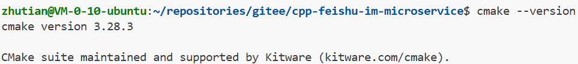

# Cmake简单使用
## 1. CMake 介绍

CMake 是一个开源、跨平台的构建系统，主要用于软件的构建、测试和打包。

CMake 使用平台无关的配置文件 **CMakeLists.txt** 来控制软件的编译过程，并生成适用于不同编译器环境的项目文件。例如，它可以生成 Unix 系统的 Makefile、Windows 下的 Visual Studio 项目文件或 Mac 的 Xcode 工程文件，从而简化了跨平台和交叉编译的工作流程。CMake 并不直接构建软件，而是产生标准的构建文件，然后使用这些文件在各自的构建环境中构建软件。
> 虽然写cmake在生成makefile是绕了个圈子，但是相比于我们写的简单的makefile，cmake在生成的makefile会采用最优解，编译的效率会比我们简单些的高

### CMake 有以下几个特点：

- **开放源代码**：使用类 BSD 许可发布
- **跨平台**：并可生成编译配置文件，在 Linux/Unix 平台，生成 makefile；在苹果平台，可以生成 xcode；在 Windows 平台，可以生成 MSVC 的工程文件
- **能够管理大型项目**：KDE4 就是最好的证明
- **简化编译构建过程和编译过程**：CMake 的工具链非常简单：cmake+make
- **高效率**：按照 KDE 官方说法，CMake 构建 KDE4 的 kdelibs 要比使用 autotools 来构建 KDE3.5.6 的 kdelibs 快 40%，主要是因为 CMake 在工具链中没有 libtool
- **可扩展**：可以为 cmake 编写特定功能的模块，扩充 cmake 功能

## 2. CMake 安装

- **Ubuntu 22.04 安装 cmake**

```
Shell
sudo apt update
sudo apt install cmake
```

- **确定 cmake 是否安装成功**

```
Shell
cmake --version
```




## 3. 入门样例 - Hello-world工程
创建hello-world 目录， 并在其目录下创建main.cpp源文件和CMakeLists.txt文件
```Shell
zhutian@VM-0-10-ubuntu:~/repositories/gitee/cpp-wechat-im-microservice/example/cmake$ tree
.
├── CMakeList.txt
└── main.cc

1 directory, 2 files
```
 
 ```C++
 #include <iostream>

using namespace std;

int main()

{
    std::cout << "hello world" << std::endl;
    return 0;
}
 ```
  CMakeList.txt如下
  ```
# 声明所需要的cmake版本
cmake_minimum_required(VERSION 3.0.0)
# 定义项目工程名称(但是不是说生成的可执行程序就一定要叫这个)
project(test)
# 设置生成目标(第一个是生成的程序名称，后面为所依赖的cpp文件)
add_executable(main main.cc)
  ```
  > 与makefile不同，CMakeList.txt中的CML需要大写，进行文件匹配
  
  