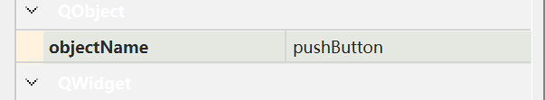

## 图形化

Qt提供了很多种功能的按钮，这里我们使用最基础的PushButton就可以了


当然现在这个按钮我们点击没有其他效果
connect() 函数是Q_OBJECT这个类提供的静态函数，这个函数的作用就是连接信号和槽
这里跟网络编程的connect没联系
```C++
connect()
```



ui->pushButton 是访问到form file（ui文件)中创建的控件。在Qt中创建一个控件的时候，此时就会给这个控件分配一个objectName属性，这个属性的值要求是在界面中唯一，不能和别人重复。当这个objectName修改后，ui->内的成员也就不同了。在预处理.ui文件的时候就会根据这里的objectName生成对应的C++代码，代码中QPushButton对象的变量名就是这里的objectName，这个变量就是ui属性的成员变量