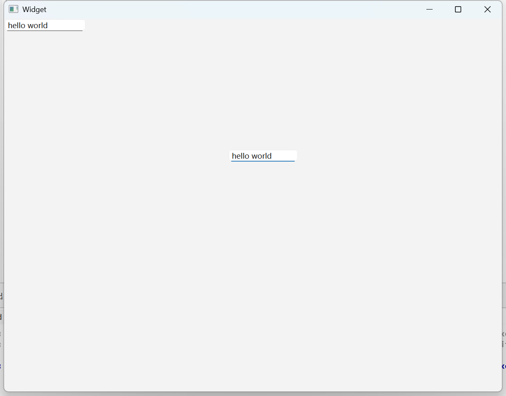

## 图形化
分为单行输入框 ：QLineEdit和多行输入框：QTextExit


## 代码

```C++
#include "widget.h"
#include "ui_widget.h"

Widget::Widget(QWidget *parent)
    : QWidget(parent)
    , ui(new Ui::Widget)
{
    ui->setupUi(this);
    QLineEdit* edit=new QLineEdit(this);
    edit->setText("hello world");
}

Widget::~Widget()
{
    delete ui;
}

```

