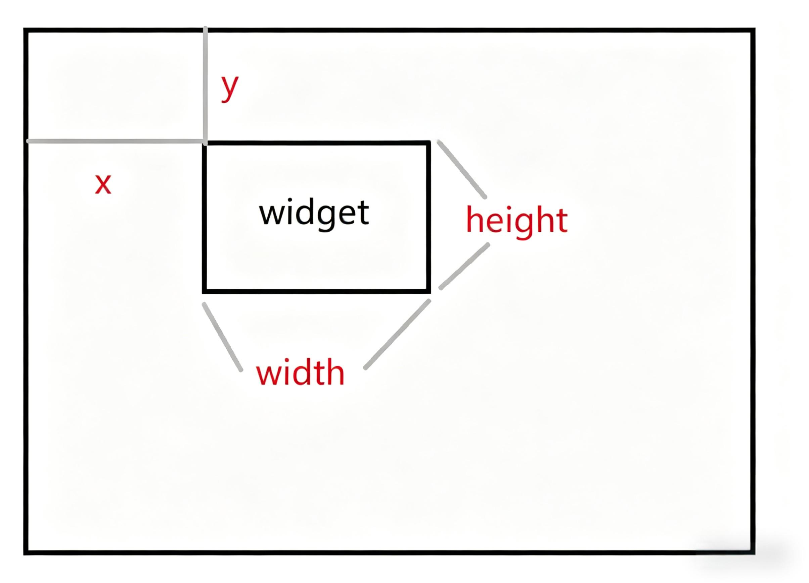
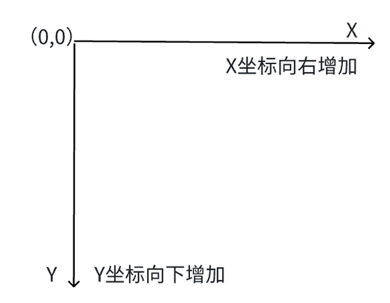
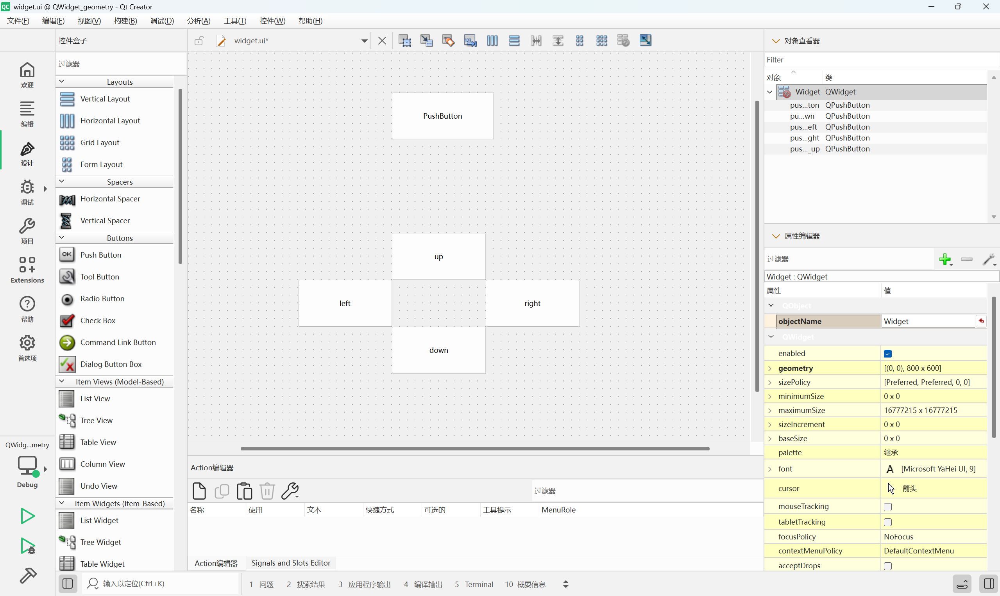
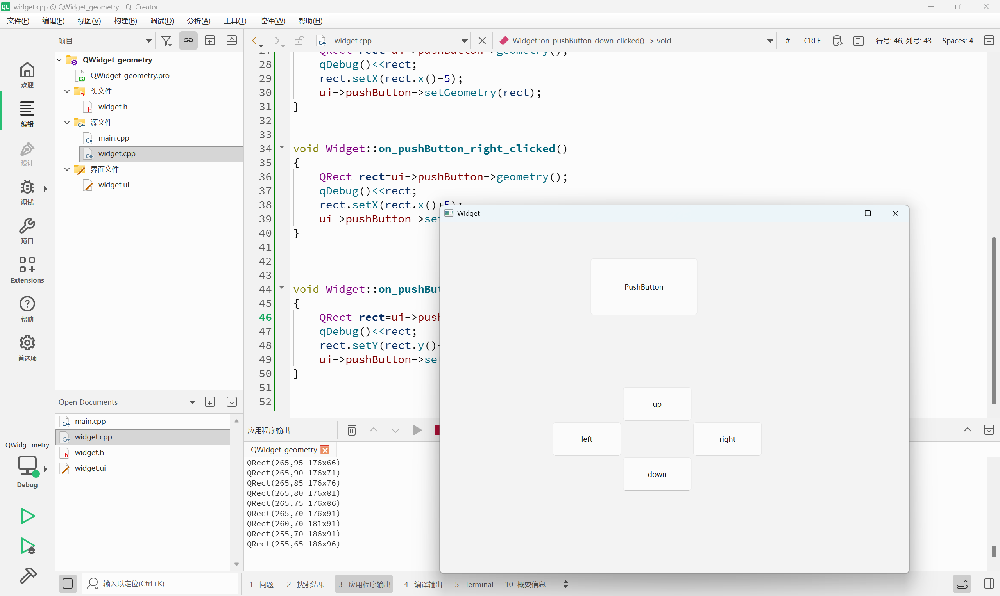
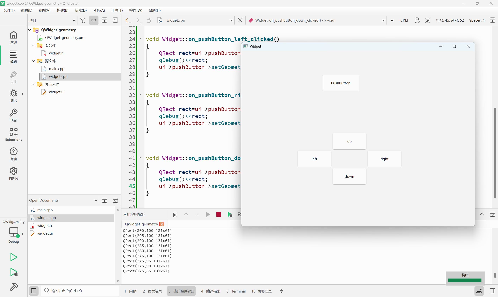
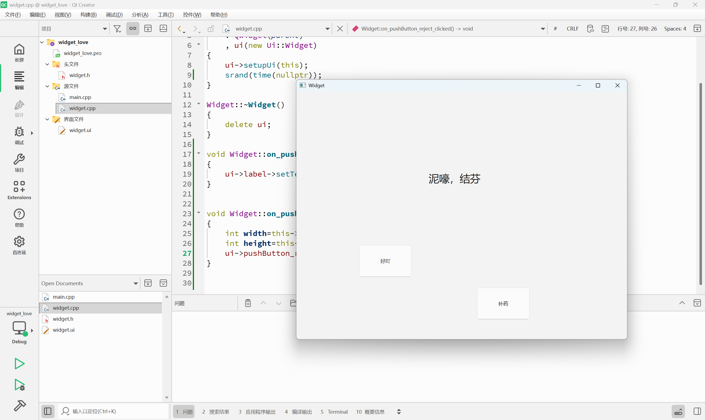
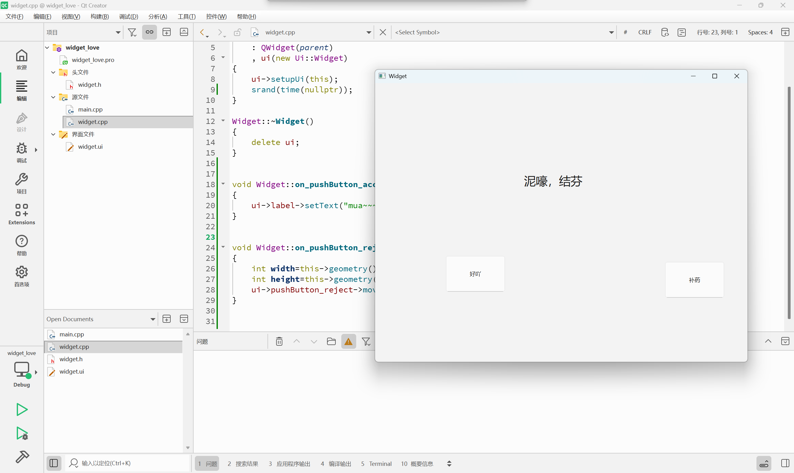
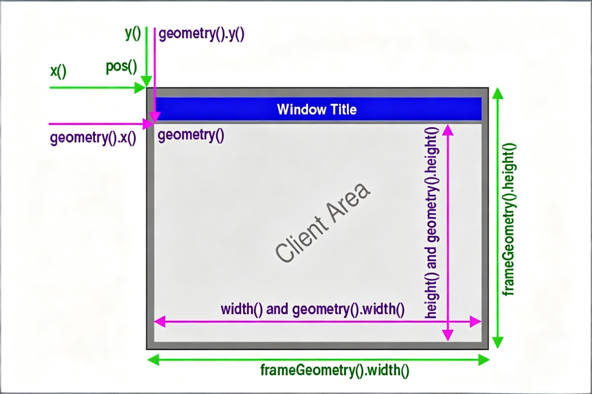
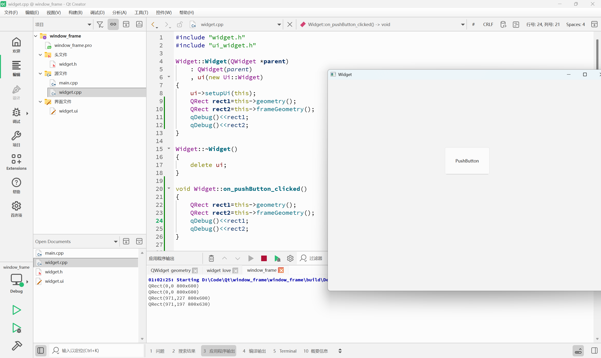
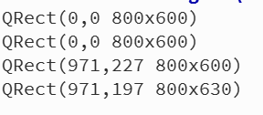

## QWidget控件
Qt中的各种控件都是继承自QWidget类，所以QWidget中的部分在Qt的控件体系中属于通用部分

我们在Qt Creator右侧，可以看到QWidget的各种属性，并且在这里也能直接进行编辑

| 属性                    | 作用                                                                                                                                                                                                                                                                                                                                  |
| --------------------- | ----------------------------------------------------------------------------------------------------------------------------------------------------------------------------------------------------------------------------------------------------------------------------------------------------------------------------------- |
| enabled               | 设置控件是否可使用。`true` 表示可用，`false` 表示禁用。                                                                                                                                                                                                                                                                                                 |
| geometry              | 位置和尺寸。包含 x, y, width, height 四个部分。<br>其中坐标是以父元素为参考进行设置的。                                                                                                                                                                                                                                                                            |
| windowTitle           | 设置 widget 标题                                                                                                                                                                                                                                                                                                                        |
| windowIcon            | 设置 widget 图标                                                                                                                                                                                                                                                                                                                        |
| windowOpacity         | 设置 widget 透明度                                                                                                                                                                                                                                                                                                                       |
| cursor                | 鼠标悬停时显示的图标形状。<br>是普通箭头，还是沙漏，还是十字等形状。<br>在 Qt Designer 界面中可以清楚看到可选项。                                                                                                                                                                                                                                                                 |
| font                  | 字体相关属性。<br>涉及到字体家族，字体大小，粗体，斜体，下划线等等样式。                                                                                                                                                                                                                                                                                              |
| toolTip               | 鼠标悬停在 widget 上会在状态栏中显示的提示信息。                                                                                                                                                                                                                                                                                                        |
| toolTipDuring         | toolTip 显示的持续时间。                                                                                                                                                                                                                                                                                                                    |
| statusTip             | Widget 状态发生改变时显示的提示信息(比如按钮被按下等)。                                                                                                                                                                                                                                                                                                    |
| whatsThis             | 鼠标悬停并按下 alt+F1 时，显示的帮助信息(显示在一个弹出的窗口中)。                                                                                                                                                                                                                                                                                              |
| styleSheet            | 允许使用 CSS 来设置 widget 中的样式。<br>Qt 中支持的样式非常丰富，对于前端开发人员上手是非常友好的。                                                                                                                                                                                                                                                                        |
| focusPolicy           | 该 widget 如何获取到焦点。<br>- `Qt::NoFocus`：控件不参与焦点管理，即无法通过键盘或鼠标获取焦点<br>- `Qt::TabFocus`：控件可以通过Tab键获得焦点<br>- `Qt::ClickFocus`：控件可以通过鼠标点击获得焦点<br>- `Qt::StrongFocus`：控件可以通过键盘和鼠标获得焦点<br>- `Qt::WheelFocus`：控件可以通过鼠标滚轮获得焦点（在某些平台或样式中可能不可用）                                                                                                   |
| contextMenuPolicy     | 上下文菜单的显示策略。<br>- `Qt::DefaultContextMenu`：默认的上下文菜单策略，用户可以通过鼠标右键或键盘快捷键触发上下文菜单<br>- `Qt::NoContextMenu`：禁用上下文菜单，即使用户点击鼠标右键也不会显示菜单<br>- `Qt::PreventContextMenu`：防止控件显示上下文菜单，即使用户点击鼠标右键也不会显示菜单<br>- `Qt::ActionsContextMenu`：将上下文菜单替换为控件的“动作”菜单，用户可以通过鼠标右键或键盘快捷键触发这个菜单<br>- `Qt::CustomContextMenu`：使用自定义的上下文菜单，用户可以通过鼠标右键或键盘快捷键触发这个菜单 |
| locale                | 设置语言和国家地区。                                                                                                                                                                                                                                                                                                                          |
| acceptDrops           | 该部件是否接受拖放操作。<br>如果设置为true，那么该部件就可以接收来自其他部件的拖放操作。当一个部件被拖放到该部件上时，该部件会接收到相应的拖放事件（dropEvent）。<br>如果设置为false，那么该部件将不会接收任何拖放操作。                                                                                                                                                                                                           |
| minimumSize           | 控件的最小尺寸。包含最小宽度和最小高度。                                                                                                                                                                                                                                                                                                                |
| maximumSize           | 控件的最大尺寸。包含最大宽度和最大高度。                                                                                                                                                                                                                                                                                                                |
| sizePolicy            | 尺寸策略。设置控件在布局管理器中的缩放方式。                                                                                                                                                                                                                                                                                                              |
| windowModality        | 指定窗口是否具有"模态"行为。                                                                                                                                                                                                                                                                                                                     |
| sizeIncrement         | 拖动窗口大小时的增量单位。                                                                                                                                                                                                                                                                                                                       |
| baseSize              | 窗口的基础大小，用来搭配sizeIncrement调整组件尺寸是计算组件应该调整到的合适的值。                                                                                                                                                                                                                                                                                     |
| palette               | 调色板。可以设置 widget 的颜色风格。                                                                                                                                                                                                                                                                                                              |
| mouseTracking         | 是否要跟踪鼠标移动事件。<br>如果设为 true，表示需要跟踪，则鼠标划过的时候该 widget 就能持续收到鼠标移动事件。<br>如果设为 false，表示不需要跟踪，则鼠标划过的时候 widget 不会收到鼠标移动事件，只能收到鼠标按下或者释放的事件。                                                                                                                                                                                                   |
| tabletTracking        | 是否跟踪触摸屏的移动事件。<br>类似于 mouseTracking。Qt 5.9 中引入的新属性。                                                                                                                                                                                                                                                                                  |
| layoutDirection       | 布局方向。<br>- `Qt::LeftToRight`：文本从左到右排列，也是默认值。<br>- `Qt::RightToLeft`：文本从右到左排列。<br>- `Qt::GlobalAtomics`：部件的布局方向由全局原子性决定                                                                                                                                                                                                              |
| autoFillBackground    | 是否自动填充背景颜色。                                                                                                                                                                                                                                                                                                                         |
| windowFilePath        | 能够把 widget 和一个本地文件路径关联起来。PS: 其实作用不大。                                                                                                                                                                                                                                                                                                |
| accessibleName        | 设置 widget 的可访问名称。这个名称可以被辅助技术 (像屏幕阅读器) 获取到。<br>这个属性用于实现无障碍程序的场景中 (也就是给盲人写的程序)。[无障碍](https://www.bilibili.com/video/BV1954y1d7z9/ "无障碍生活")                                                                                                                                                                                            |
| accessibleDescription | 设置 widget 的详细描述。作用同 accessibleName                                                                                                                                                                                                                                                                                                  |
| inputMethodHints      | 针对输入框有效，用来提示用户当前能输入的合法数据的格式。比如只能输入数字，只能输入日期等。                                                                                                                                                                                                                                                                                       |

### enable

|     API     |               说明                |
| :---------: | :-----------------------------: |
| isEnabled() |           获取到控件的可用状态            |
| setEnable() | 设置控件是否可用，`true`表示可用,`false`表示禁用 |
- 所谓“禁用”指的是该控件不能接收任何用户的输入事件，并且往往外观是灰色的
- 如果一个widget被禁用，那么这个widget对象树下的所有子元素也会被禁用

```C++
#include "widget.h"
#include "ui_widget.h"
#include <QPushButton>
#include <QDebug>

Widget::Widget(QWidget *parent)
    : QWidget(parent)
    , ui(new Ui::Widget)
{
    ui->setupUi(this);
    QPushButton* button=new QPushButton(this);
    button->setText("按钮");
    button->setEnabled(false);
    connect(button,&QPushButton::clicked,this,&Widget::handle);
}

Widget::~Widget()
{
    delete ui;
}

void Widget::handle()
{
    qDebug("handle");
}

```


```C++
#include "widget.h"
#include "ui_widget.h"
#include <QPushButton>
#include <QDebug>

Widget::Widget(QWidget *parent)
    : QWidget(parent)
    , ui(new Ui::Widget)
{
    ui->setupUi(this);

}

Widget::~Widget()
{
    delete ui;
}


void Widget::on_pushButton_enable_clicked()
{
    bool status=ui->pushButton->isEnabled();
    if(status)
    {
        ui->pushButton->setEnabled(false);
    }
    else
    {
        ui->pushButton->setEnabled(true);
    }
}


void Widget::on_pushButton_clicked()
{
    qDebug("执行");
}


```
在同一个界面中，要求不同的控件objectName必须是不同的，后续就可以通过ui->objectName获取控件对象了，
元编程，Qt会根据ui文件，生成一个ui_widget.h文件，生成的过程中就会感知到，界面上有哪些控件的objectName
当前自动生成的objectName的规律是控件类型+下划线+数字。但用数字的方式命名，显然不是很好的编程习惯，所以可以根据需要改为其他名字，如pushButton_enable

### geometry
geometry的含义是几何，可以把geometry视为x,y,width,height四个属性的统称，也就是当前控件的位置和尺寸

但是实际开发中，我们并不会直接使用这几个属性，而是通过一系列封装的方法来获取 / 修改.
对于 Qt 的坐标系，不要忘记是一个 "左手坐标系". 其中坐标系的原点是当前元素的父元素的左上角.



| API                                                                            | 说明                                                                  |
| ------------------------------------------------------------------------------ | ------------------------------------------------------------------- |
| `geometry()`                                                                   | 获取到控件的位置和尺寸。返回结果是一个 QRect, 包含了 x, y, width, height. 其中 x,y 是左上角的坐标. |
| `setGeometry(QRect)`<br><br>`setGeometry(int x, int y, int width, int height)` | 设置控件的位置和尺寸。可以直接设置一个 QRect, 也可以分四个属性单独设置.                            |

**代码示例：控制按钮的位置**

在界面中拖五个按钮.
五个按钮的 objectName 分别为`pushButton_target`，`pushButton_up`，`pushButton_down`，`pushButton_left`，`pushButton_right`

五个按钮的初始位置和大小都随意.

```C++
// widget.cpp
#include "widget.h"
#include "ui_widget.h"

Widget::Widget(QWidget *parent)
    : QWidget(parent)
    , ui(new Ui::Widget)
{
    ui->setupUi(this);
}

Widget::~Widget()
{
    delete ui;
}

void Widget::on_pushButton_up_clicked()
{
    QRect rect=ui->pushButton->geometry();
    qDebug()<<rect;
    rect.setY(rect.y()-5);
    ui->pushButton->setGeometry(rect);
}


void Widget::on_pushButton_left_clicked()
{
    QRect rect=ui->pushButton->geometry();
    qDebug()<<rect;
    rect.setX(rect.x()-5);
    ui->pushButton->setGeometry(rect);
}


void Widget::on_pushButton_right_clicked()
{
    QRect rect=ui->pushButton->geometry();
    qDebug()<<rect;
    rect.setX(rect.x()+5);
    ui->pushButton->setGeometry(rect);
}


void Widget::on_pushButton_down_clicked()
{
    QRect rect=ui->pushButton->geometry();
    qDebug()<<rect;
    rect.setY(rect.y()+5);
    ui->pushButton->setGeometry(rect);
}


```



运行程序，可以看到，按下下方的四个按钮，就会控制 target 的左上角的位置。对应的按钮整个尺寸也会发生改变。

上述代码中我们是直接设置的 QRect 中的 x, y。实际上 QRect 内部是存储了左上和右下两个点的坐标，再通过这两个点的坐标差值计算长宽。

单纯修改左上坐标就会引起整个矩形的长宽发生改变。

我们也可以通过代码发现，Qt中的qDebug对大多数Qt的内置类型都做了输出的重载，可以直接打印出QRect的数值

而如果我们想要整个按钮移动可以用以下方式
```C++
// widget.cpp
#include "widget.h"
#include "ui_widget.h"

Widget::Widget(QWidget *parent)
    : QWidget(parent)
    , ui(new Ui::Widget)
{
    ui->setupUi(this);
}

Widget::~Widget()
{
    delete ui;
}

void Widget::on_pushButton_up_clicked()
{
    QRect rect=ui->pushButton->geometry();
    qDebug()<<rect;
    ui->pushButton->setGeometry(rect.x(),rect.y()-5,rect.width(),rect.height());
}


void Widget::on_pushButton_left_clicked()
{
    QRect rect=ui->pushButton->geometry();
    qDebug()<<rect;
    ui->pushButton->setGeometry(rect.x()-5,rect.y(),rect.width(),rect.height());
}


void Widget::on_pushButton_right_clicked()
{
    QRect rect=ui->pushButton->geometry();
    qDebug()<<rect;
    ui->pushButton->setGeometry(rect.x()+5,rect.y(),rect.width(),rect.height());
}


void Widget::on_pushButton_down_clicked()
{
    QRect rect=ui->pushButton->geometry();
    qDebug()<<rect;
    ui->pushButton->setGeometry(rect.x(),rect.y()+5,rect.width(),rect.height());
}


```




**代码示例：一个表白程序**

往界面上拖拽两个按钮和一个 Label。
两个按钮的 objectName 分别为`pushButton_accept` 和 `pushButton_reject`
Label 的 objectName 为 `label`

控件中文本如下图所示。

```C++
// widget.cpp
#include "widget.h"
#include "ui_widget.h"

Widget::Widget(QWidget *parent)
    : QWidget(parent)
    , ui(new Ui::Widget)
{
    ui->setupUi(this);
    srand(time(nullptr));
}

Widget::~Widget()
{
    delete ui;
}

void Widget::on_pushButton_accept_clicked()
{
    ui->label->setText("mua~~~");
}


void Widget::on_pushButton_reject_clicked()
{
    int width=this->geometry().width();
    int height=this->geometry().height();
    ui->pushButton_reject->move(rand()%width,rand()%height);
}


```

这样就能实现，当点击按钮时，按钮移动


```C++
// widget.cpp
#include "widget.h"
#include "ui_widget.h"

Widget::Widget(QWidget *parent)
    : QWidget(parent)
    , ui(new Ui::Widget)
{
    ui->setupUi(this);
    srand(time(nullptr));
}

Widget::~Widget()
{
    delete ui;
}


void Widget::on_pushButton_accept_pressed()
{
    ui->label->setText("mua~~~");
}


void Widget::on_pushButton_reject_pressed()
{
    int width=this->geometry().width();
    int height=this->geometry().height();
    ui->pushButton_reject->move(rand()%width,rand()%height);
}


```


而如果采用pressed，则时按下，还没松开就移动


由此可见，按钮移动可以setGeometry 也可以 move

上述代码使用的是 pressed，鼠标按下事件。如果使用 `mouseMoveEvent`，会更狠一些，只要鼠标移动过来，按钮就跑了。

对应的代码更麻烦一些（需要自定义类继承自 QPushButton，重写 `mouseMoveEvent` 方法）。此处暂时不展开。


## window frame 的影响

如果 widget 作为一个窗口（带有标题栏，最小化，最大化，关闭按钮），那么在计算尺寸和坐标的时候就有两种算法：**包含 window frame** 和 **不包含 window frame**。

其中 `x()`, `y()`, `frameGeometry()`, `pos()`, `move()` 都是按照**包含 window frame** 的方式来计算的。

其中 `geometry()`, `width()`, `height()`, `rect()`, `size()` 则是按照**不包含 window frame** 的方式来计算的。

当然，如果一个不是作为窗口的 widget，上述两类方式得到的结果是一致的。
操作系统自带的





一、包含 window frame 计算

|API|说明|
|---|---|
|`x()`|获取横坐标，计算时包含 window frame|
|`y()`|获取纵坐标，计算时包含 window frame|
|`pos()`|返回 QPoint 对象，内含 x (), y (), setX (), setY () 等方法，计算时包含 window frame|
|`frameSize()`|返回 QSize 对象，内含 width (), height (), setWidth (), setHeight () 等方法，计算时包含 window frame|
|`frameGeometry()`|返回 QRect 对象（QPoint+QSize 结合体），可获取 x,y,width,size，计算时包含 window frame 对象|
二、不包含 window frame 计算

|API|说明|
|---|---|
|`width()`|获取宽度，计算时不包含 window frame|
|`height()`|获取高度，计算时不包含 window frame|
|`size()`|返回 QSize 对象，内含 width (), height (), setWidth (), setHeight () 等方法，计算时不包含 window frame|
|`rect()`|返回 QRect 对象，可获取并设置 x,y,width,size，计算时不包含 window frame 对象|
|`geometry()`|返回 QRect 对象，可获取 x,y,width,size，计算时不包含 window frame 对象|
|`setGeometry()`|直接设置窗口位置和尺寸，可传入 x,y,width,height 或 QRect 对象，计算时不包含 window frame 对象|
认真观察上面的表格，可以看到，其实这里的 API 有 `frameGeometry` 和 `geometry` 两个就足够完成所有的需求了。

为什么要提供这么多功能重复的 API 呢？

这个就涉及到 Qt API 的设计理念了：**尽量符合人的直觉**。

举个例子，Qt 的 QVector，尾插元素操作，有以下方法：

- `push_back`
- `append`
- `+=`
- `<<`

上述方法的效果都是等价的。即使不翻阅文档，单纯的凭借直觉就能把代码写对。


代码示例: 感受 geometry 和 frameGeometry 的区别 

在界面上放置一个按钮。



```C++
#include "widget.h"
#include "ui_widget.h"

Widget::Widget(QWidget *parent)
    : QWidget(parent)
    , ui(new Ui::Widget)
{
    ui->setupUi(this);
    QRect rect1=this->geometry();
    QRect rect2=this->frameGeometry();
    qDebug()<<rect1;
    qDebug()<<rect2;
}

Widget::~Widget()
{
    delete ui;
}

void Widget::on_pushButton_clicked()
{
    QRect rect1=this->geometry();
    QRect rect2=this->frameGeometry();
    qDebug()<<rect1;
    qDebug()<<rect2;
}


```



执行程序，可以看到，构造函数中，打印出的 geometry 和 frameGeometry 是相同的。

但是在点击按钮时，打印的 geometry 和 frameGeometry 则存在差异。

>在构造方法中，Widget 刚刚创建出来，还没有加入到对象树中。此时也就不具备 Window frame。

> 在按钮的 slot 函数中，由于用户点击的时候，对象树已经构造好了，此时 Widget 已经具备了 Window frame，因此在位置和尺寸上均出现了差异。

> 如果把上述代码修改成打印 pushButton 的 geometry 和 frameGeometry，结果就是完全相同的。因为 pushButton 并非是一个窗口。

简单来说，当这段代码在构造函数中时，此时Widget对象正在构造，还没有被加入到window frame中。因此还看不到window frame的影响