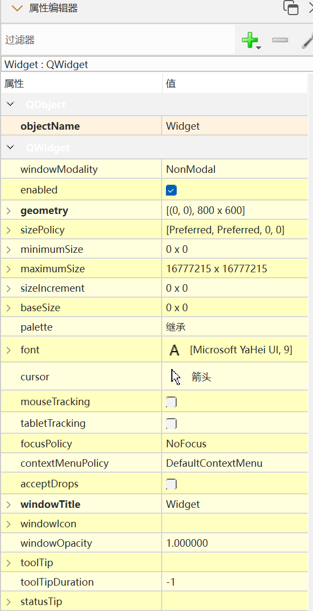
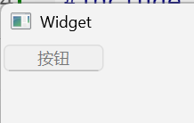

Qt中的各种控件都是继承自QWidget类，所以QWidget中的部分在Qt的控件体系中属于通用部分

我们在Qt Creator右侧，可以看到QWidget的各种属性，并且在这里也能直接进行编辑

| 属性                    | 作用                                                                                                                                                                                                                                                                                                                                  |
| --------------------- | ----------------------------------------------------------------------------------------------------------------------------------------------------------------------------------------------------------------------------------------------------------------------------------------------------------------------------------- |
| enabled               | 设置控件是否可使用。`true` 表示可用，`false` 表示禁用。                                                                                                                                                                                                                                                                                                 |
| geometry              | 位置和尺寸。包含 x, y, width, height 四个部分。<br>其中坐标是以父元素为参考进行设置的。                                                                                                                                                                                                                                                                            |
| windowTitle           | 设置 widget 标题                                                                                                                                                                                                                                                                                                                        |
| windowIcon            | 设置 widget 图标                                                                                                                                                                                                                                                                                                                        |
| windowOpacity         | 设置 widget 透明度                                                                                                                                                                                                                                                                                                                       |
| cursor                | 鼠标悬停时显示的图标形状。<br>是普通箭头，还是沙漏，还是十字等形状。<br>在 Qt Designer 界面中可以清楚看到可选项。                                                                                                                                                                                                                                                                 |
| font                  | 字体相关属性。<br>涉及到字体家族，字体大小，粗体，斜体，下划线等等样式。                                                                                                                                                                                                                                                                                              |
| toolTip               | 鼠标悬停在 widget 上会在状态栏中显示的提示信息。                                                                                                                                                                                                                                                                                                        |
| toolTipDuring         | toolTip 显示的持续时间。                                                                                                                                                                                                                                                                                                                    |
| statusTip             | Widget 状态发生改变时显示的提示信息(比如按钮被按下等)。                                                                                                                                                                                                                                                                                                    |
| whatsThis             | 鼠标悬停并按下 alt+F1 时，显示的帮助信息(显示在一个弹出的窗口中)。                                                                                                                                                                                                                                                                                              |
| styleSheet            | 允许使用 CSS 来设置 widget 中的样式。<br>Qt 中支持的样式非常丰富，对于前端开发人员上手是非常友好的。                                                                                                                                                                                                                                                                        |
| focusPolicy           | 该 widget 如何获取到焦点。<br>- `Qt::NoFocus`：控件不参与焦点管理，即无法通过键盘或鼠标获取焦点<br>- `Qt::TabFocus`：控件可以通过Tab键获得焦点<br>- `Qt::ClickFocus`：控件可以通过鼠标点击获得焦点<br>- `Qt::StrongFocus`：控件可以通过键盘和鼠标获得焦点<br>- `Qt::WheelFocus`：控件可以通过鼠标滚轮获得焦点（在某些平台或样式中可能不可用）                                                                                                   |
| contextMenuPolicy     | 上下文菜单的显示策略。<br>- `Qt::DefaultContextMenu`：默认的上下文菜单策略，用户可以通过鼠标右键或键盘快捷键触发上下文菜单<br>- `Qt::NoContextMenu`：禁用上下文菜单，即使用户点击鼠标右键也不会显示菜单<br>- `Qt::PreventContextMenu`：防止控件显示上下文菜单，即使用户点击鼠标右键也不会显示菜单<br>- `Qt::ActionsContextMenu`：将上下文菜单替换为控件的“动作”菜单，用户可以通过鼠标右键或键盘快捷键触发这个菜单<br>- `Qt::CustomContextMenu`：使用自定义的上下文菜单，用户可以通过鼠标右键或键盘快捷键触发这个菜单 |
| locale                | 设置语言和国家地区。                                                                                                                                                                                                                                                                                                                          |
| acceptDrops           | 该部件是否接受拖放操作。<br>如果设置为true，那么该部件就可以接收来自其他部件的拖放操作。当一个部件被拖放到该部件上时，该部件会接收到相应的拖放事件（dropEvent）。<br>如果设置为false，那么该部件将不会接收任何拖放操作。                                                                                                                                                                                                           |
| minimumSize           | 控件的最小尺寸。包含最小宽度和最小高度。                                                                                                                                                                                                                                                                                                                |
| maximumSize           | 控件的最大尺寸。包含最大宽度和最大高度。                                                                                                                                                                                                                                                                                                                |
| sizePolicy            | 尺寸策略。设置控件在布局管理器中的缩放方式。                                                                                                                                                                                                                                                                                                              |
| windowModality        | 指定窗口是否具有"模态"行为。                                                                                                                                                                                                                                                                                                                     |
| sizeIncrement         | 拖动窗口大小时的增量单位。                                                                                                                                                                                                                                                                                                                       |
| baseSize              | 窗口的基础大小，用来搭配sizeIncrement调整组件尺寸是计算组件应该调整到的合适的值。                                                                                                                                                                                                                                                                                     |
| palette               | 调色板。可以设置 widget 的颜色风格。                                                                                                                                                                                                                                                                                                              |
| mouseTracking         | 是否要跟踪鼠标移动事件。<br>如果设为 true，表示需要跟踪，则鼠标划过的时候该 widget 就能持续收到鼠标移动事件。<br>如果设为 false，表示不需要跟踪，则鼠标划过的时候 widget 不会收到鼠标移动事件，只能收到鼠标按下或者释放的事件。                                                                                                                                                                                                   |
| tabletTracking        | 是否跟踪触摸屏的移动事件。<br>类似于 mouseTracking。Qt 5.9 中引入的新属性。                                                                                                                                                                                                                                                                                  |
| layoutDirection       | 布局方向。<br>- `Qt::LeftToRight`：文本从左到右排列，也是默认值。<br>- `Qt::RightToLeft`：文本从右到左排列。<br>- `Qt::GlobalAtomics`：部件的布局方向由全局原子性决定                                                                                                                                                                                                              |
| autoFillBackground    | 是否自动填充背景颜色。                                                                                                                                                                                                                                                                                                                         |
| windowFilePath        | 能够把 widget 和一个本地文件路径关联起来。PS: 其实作用不大。                                                                                                                                                                                                                                                                                                |
| accessibleName        | 设置 widget 的可访问名称。这个名称可以被辅助技术 (像屏幕阅读器) 获取到。<br>这个属性用于实现无障碍程序的场景中 (也就是给盲人写的程序)。[无障碍](https://www.bilibili.com/video/BV1954y1d7z9/ "无障碍生活")                                                                                                                                                                                            |
| accessibleDescription | 设置 widget 的详细描述。作用同 accessibleName                                                                                                                                                                                                                                                                                                  |
| inputMethodHints      | 针对输入框有效，用来提示用户当前能输入的合法数据的格式。比如只能输入数字，只能输入日期等。                                                                                                                                                                                                                                                                                       |

### enable

|     API     |               说明                |
| :---------: | :-----------------------------: |
| isEnabled() |           获取到控件的可用状态            |
| setEnable() | 设置控件是否可用，`true`表示可用,`false`表示禁用 |
- 所谓“禁用”指的是该控件不能接收任何用户的输入事件，并且往往外观是灰色的
- 如果一个widget被禁用，那么这个widget对象树下的所有子元素也会被禁用

```C++
#include "widget.h"
#include "ui_widget.h"
#include <QPushButton>
#include <QDebug>

Widget::Widget(QWidget *parent)
    : QWidget(parent)
    , ui(new Ui::Widget)
{
    ui->setupUi(this);
    QPushButton* button=new QPushButton(this);
    button->setText("按钮");
    button->setEnabled(false);
    connect(button,&QPushButton::clicked,this,&Widget::handle);
}

Widget::~Widget()
{
    delete ui;
}

void Widget::handle()
{
    qDebug("handle");
}

```

