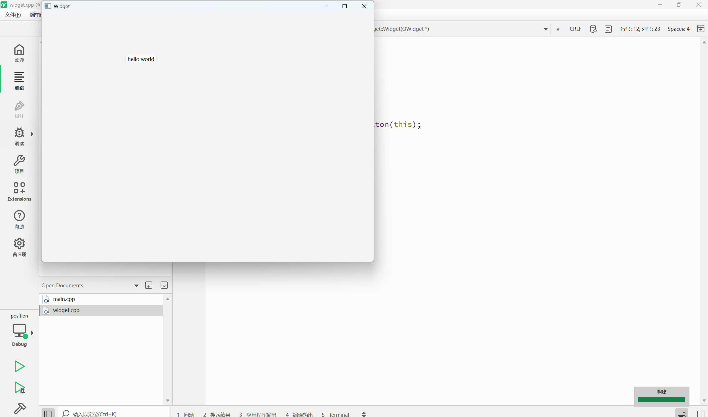
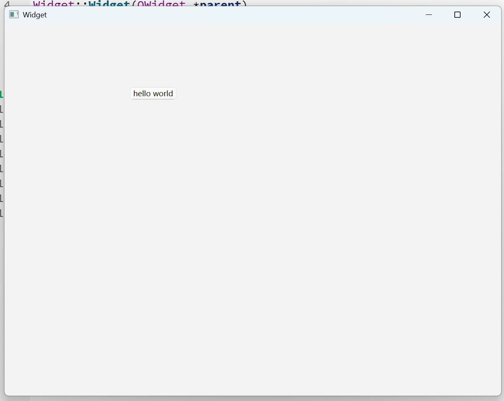

## Qt 中变量命名风格
1. 起名字要有描述性，不要使用abc等这种比较无规律的名字
2. 如果名字比较长，由多个单词构成，就要用适当的方式区分不同单词
- 蛇形命名法：student_count, unordered_map
- 驼峰命名法(Qt中偏好使用大写字母进行单词分割)：studentCount,QApplication,QWidget (首字母小写为小驼峰，多用于给变量/函数命名，首字母大写为大驼峰，多用于给类命名)
编程中驼峰命名法用的程度更多，蛇形命名法主要用在C/C++/Python，Java/Js/Go偏好驼峰命名法。用什么主打一个入乡随俗

## Qt Creator快捷键


## 使用帮助文档
一定要有查询文档的意识！！！
未来实际开发中，一定会用到很多第三方库或者框架，很可能用到的库/框架比较小众，网上很难找到一些相关资料
最核心的参考资料就是官方文档（大概率是英文的）

使用帮助文档有三种方式，实际编程用哪种都可以
1. 光标放在要查询的类名/方法名上，直接按F1
2. Qt Creator左侧栏中的帮助按钮
3. Qt文档程序


## Qt 窗口坐标体系
坐标体系：**以左上角（屏幕左上角或者窗口左上角）为原点（0，0），X轴向右增长，Y轴向下增长**，
> - 给Qt某个控件，设置位置，就要指定坐标，对于这个控件来说，坐标系原点就是相对于父窗口/控件的
> - 如QWidget中有一个QPushButton，QPushButton的父元素/父控件/父窗口就是QWidget
> - QWidget没有父元素（NULL），就相当于父元素是整个显示器桌面了


数学中的坐标系为右手坐标系（右手系）
计算机中的坐标系为左手坐标系（左手系）


```C++
#include "widget.h"
#include "ui_widget.h"
#include <QPushButton>
Widget::Widget(QWidget *parent)
    : QWidget(parent)
    , ui(new Ui::Widget)
{
    ui->setupUi(this);
    QPushButton* button=new QPushButton(this);
    button->setText("hello world");
    button->move(200,100);
    this->move(100,0);
}

Widget::~Widget()
{
    delete ui;
}

```


可以通过move函数改变位置，这里要注意，最上侧的白栏是系统自动生成的，不属于Widget范围内，坐标后面的单位是像素。可以通过this指针改变窗口的位置