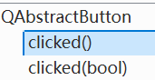
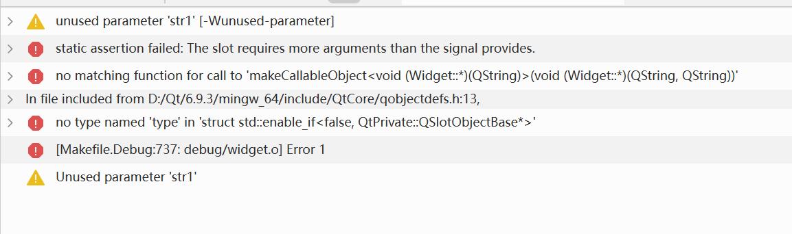
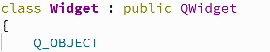

## 信号
在Linux信号中Signal用于系统内部的通知机制，进程间通信方式
信号源：谁发的信号
信号类型：哪种类型信号
信号的处理方式：注册信号处理函数，在信号被触发的时候自动调用执行

Qt中，信号涉及三个要素
信号源：由哪个控件发出的信号
信号类型：用户进行不同的操作，就可能触发不同的信号。如点击按钮，触发点击信号。在输入框中移动光标，触发移动光标信号。勾选一个复选框，选择一个下拉框，都会触发不同信号
信号的处理方式：槽（slot）=>函数。Qt中可以使用connect这样的函数，把一个信号和一个槽关联起来，后续只要信号触发了，Qt就会自动触发槽函数（所谓槽函数就是一个回调函数callback）

一定是先把信号的处理方式准备好，再触发信号。Qt中，一定是先关联信号和槽，再触发这个信号，否则信号就不知道如何处理了（错过了）

## connect
这个函数和Linux TCP socket中建立的函数没有任何关系，只是名字一样

connect是Q_OBJECT类提供的静态的成员函数，Qt中提供的这些类，本身存在一定的继承关系
如：QPushButton、QLineEdit、QTextEdit、QRadioButton等都继承于QWidget，而QWidget继承于Q_OBJECT。QT中还有很多控件都继承于Q_OBJUCT类，类似Java

```C++
connect(const QObject *sender, // 描述了当前信号由哪个控件发出
const char * signal,  // 信号的类型
const QObject * receiver, // 哪个对象（控件）负责处理
const char * method, // 处理的方式
Qt::ConnectionType type = Qt::AutoConnection //一般不考虑这个参数
)
```

**简单例子**：界面上包含一个按钮，用户点击按钮，则关闭窗口
所谓信号，也是Qt对象中内部提供的一些成员函数

```C++
QPushButton* button=new QPushButton(this);
button->move(200,200);
button->setText("关闭");
connect(button,&QPushButton::clicked,this,&Widget::close)
```
- 图标带有锯齿，是slot(槽)函数
- 带有类似于wifi信号的图标才是信号
- click是一个slot函数，作用是在调用的时候相当于点击了一下按钮
- clicked（过去分词形式）才是触发点击信号
- connect要求，一二参数要匹配，button的类型如果是QPushButton\*，此时，第二个参数信号必须是QPushButton内置信号（父类信号），不能是一个其他的类，比如QLineEdit的信号
- close是QWidget内置的槽函数，Widget继承自QWidget，也就继承了父类的槽函数，作用是关闭当前窗口/控件

对于Qt中到底提供了哪些内置的信号和槽，我们可以通过查阅文档多了解
比如QPushButton的clicked，我们在QPushButton类中并找不到，但是我们可以去查询他的父类，也就是QAbstractButton类。因为Qt中会提供很多种按钮，这些按钮之间存在一些共性内容，就把这些共性内容，提取出来，放在了QAbstractButton类中
- clicked：鼠标按下并释放组成点击
- pressed：鼠标按下
- released：鼠标松开
看文档中的信号的时候，最重要的就是关注信号的发送时机（用户进行了什么样的操作，就能产生这样的信号）

>const char * signal,
   const char * method

我们发现connect的第二个和第四个参数是char*，而我们说的指针是一个统称，如int\*,char\*,short\*,结构体\*等，我们clicked的类型为void(\*)(),close的类型为bool(\*)()，与参数的类型并不一样，C++中不允许使用两个不同的指针类型，相互赋值（函数传参，本质就是赋值）

但是这里能正常使用，是因为这里的函数声明是旧版本Qt的connect函数，在以前版本中，传参写法和现在也有区别
那时，给信号参数传参要搭配一个SIGNAL宏，给槽函数传参要搭配SLOT宏，这两个宏可以把传入的函数指针转成char\* ，也就是connect(button,SIGNAL(&QPushButton::clicked),this,SLOT(&Widget::close));

Qt8开始，对上述写法做出了简化，不再需要写SIGNAL和SLOT宏了，给connect提供了重载版本，重载版本中，第二四个参数成了泛型参数，允许传入我们的任意类型的函数指针。并且用了C++的泛型编程，Qt封装了类型萃取器，此时connect函数就带有一定的参数检查功能。如果传入的第一个参数和第二个参数不匹配，或者第三个参数与第四个参数不匹配（指2，4参数不是1，3参数的成员函数），这个时候就会报错 


## 自定义信号与槽
## 自定义信号
Qt开发中自定义槽函数是非常关键的，开发中的大部分情况，也需要自定义槽函数
槽函数，就是用户触发某个操作之后，要进行的业务逻辑

自定义信号比较少见，实际开发中很少会需要自定义信号
信号就对应到用户的某个操作
在GUI，用户能够进行哪些操作是能穷举的。Qt内置的信号，基本能覆盖上述的所有可能的用户操作
因此，使用Qt内置信号，就足以应付大部分的开发场景
>我们的Widget 虽然没有定义任何信号，由于继承自QWidget和QObject，这两类已经提供了一些信号可以直接使用了
```C++
#ifndef WIDGET_H
#define WIDGET_H

#include <QWidget>

QT_BEGIN_NAMESPACE
namespace Ui {
class Widget;
}
QT_END_NAMESPACE

class Widget : public QWidget
{
    Q_OBJECT

public:
    void handlersignal();
    explicit Widget(QWidget *parent = nullptr);
    ~Widget() override;
signals:
    void mysignal();

private:
    Ui::Widget *ui;
};
#endif // WIDGET_H

```
所谓Qt信号，本质上也就是一个函数
Qt5以及更高版本中，槽函数和普通成员函数之间，没啥差别了
但是信号则是一类非常特殊的函数
程序员只要写出函数声明，并且告诉Qt，这是一个信号即可
这个函数的定义是Qt在编译过程中自动生成的（自动生成的过程程序员无法干预）
信号在Qt中是特殊的机制，Qt生成信号函数的实现，要配合Qt框架做很多既定的操作
作为信号函数，这个函数的返回值必须是void
有没有参数都可以，甚至可以支持重载
信号要用signals: 这样关键字，qmake调用一些代码分析/生成工具，扫描到类中包含signals这个关键字的时候，此时就会自动把下面的函数声明认为是信号，并且给这些信号函数自动生成函数定义（元编程技术）

```C++
#include "widget.h"
#include "ui_widget.h"

void Widget::handlersignal()
{
    this->setWindowTitle("handler signal");
}

Widget::Widget(QWidget *parent)
    : QWidget(parent)
    , ui(new Ui::Widget)
{
    ui->setupUi(this);
    connect(this,&Widget::mysignal,this,&Widget::handlersignal);
    emit mysignal();
}

Widget::~Widget()
{
    delete ui;
}

```
但是建立连接，不代表信号发出来了！
如何才能触发自定义信号呢？
Qt的内置信号，都不需要我们手动通过代码触发，用户在GUI进行某些操作，就会自动触发对应信号（发射信号的代码已经内置到Qt框架中了）
>emit mySignal();
>Qt中用emit关键字触发信号
>发射信号的操作可以在任意合适的代码中，不一定非要是构造函数中
>但是Qt5之后，emit并没有什么实际的操作，真正的操作在生成的 mySignal函数内部定义中包含了，不写也能发出信号。
>但实际开发中，还是建议写上emit，这样代码可读性更高，更明显的标识出，这里是发出自定义信号了

```C++
#include "widget.h"
#include "ui_widget.h"

void Widget::handlersignal()
{
    this->setWindowTitle("handler signal");
}

Widget::Widget(QWidget *parent)
    : QWidget(parent)
    , ui(new Ui::Widget)
{
    ui->setupUi(this);
    connect(this,&Widget::mysignal,this,&Widget::handlersignal);

}

Widget::~Widget()
{
    delete ui;
}

void Widget::on_pushButton_clicked()
{
     emit mysignal();
}


```
可以在适当时候发出信号

- 信号和槽也可以带参数
- 当信号带有参数的时候，槽的参数必须和信号参数一致
- 此时发射信号的时候，就可以给信号函数传递实参，与之对应的这个参数就会被传到槽函数中
- 此时就可以达到信号给槽函数传参的效果了
- 这里的参数一致是指要求类型一致，个数如果不一致也可以，不一致的时候，要求信号的参数个数必须要比槽参数个数多
- C++中声明函数的时候，形参可以不写名字

```C++
#ifndef WIDGET_H
#define WIDGET_H

#include <QWidget>

QT_BEGIN_NAMESPACE
namespace Ui {
class Widget;
}
QT_END_NAMESPACE

class Widget : public QWidget
{
    Q_OBJECT

public:
    void handlersignal(QString str);
    explicit Widget(QWidget *parent = nullptr);
    ~Widget() override;
signals:
    void mysignal(QString str);

private slots:
    void on_pushButton_clicked();

    void on_pushButton_2_clicked();

private:
    Ui::Widget *ui;
};
#endif // WIDGET_H

```
```C++
#include "widget.h"
#include "ui_widget.h"

void Widget::handlersignal(QString str)
{
    this->setWindowTitle(str);
}

Widget::Widget(QWidget *parent)
    : QWidget(parent)
    , ui(new Ui::Widget)
{
    ui->setupUi(this);
    connect(this,&Widget::mysignal,this,&Widget::handlersignal);

}

Widget::~Widget()
{
    delete ui;
}

void Widget::on_pushButton_clicked()
{
     emit mysignal("arguments1");
}


void Widget::on_pushButton_2_clicked()
{
    emit mysignal("arguments2");
}


```


- 传参可以起到复用代码的效果
- 有多个逻辑，整体上一致，但涉及的数据不同
- 可以通过函数-参数来复用代码，并且在不同的场景中传入不同的参数即可
- Qt中很多内置信号也带有参数，这些参数不是自己传递
- clicked信号就带有一个参数，这个参数对pushbutton没什么用，对于QCheckBox复选框就很有用了
**信号参数多于槽函数**
```C++
#ifndef WIDGET_H
#define WIDGET_H

#include <QWidget>

QT_BEGIN_NAMESPACE
namespace Ui {
class Widget;
}
QT_END_NAMESPACE

class Widget : public QWidget
{
    Q_OBJECT

public:
    void handlersignal(QString str);
    explicit Widget(QWidget *parent = nullptr);
    ~Widget() override;
signals:
    void mysignal(QString str,QString str1);

private slots:
    void on_pushButton_clicked();

    void on_pushButton_2_clicked();

private:
    Ui::Widget *ui;
};
#endif // WIDGET_H

```
```C++
#include "widget.h"
#include "ui_widget.h"

void Widget::handlersignal(QString str)
{
    this->setWindowTitle(str);
}

Widget::Widget(QWidget *parent)
    : QWidget(parent)
    , ui(new Ui::Widget)
{
    ui->setupUi(this);
    connect(this,&Widget::mysignal,this,&Widget::handlersignal);

}

Widget::~Widget()
{
    delete ui;
}

void Widget::on_pushButton_clicked()
{
     emit mysignal("arguments1","");
}


void Widget::on_pushButton_2_clicked()
{
    emit mysignal("arguments2","");
}


```

信号参数少于槽函数


信号函数的参数个数，少于槽函数的参数个数，此时代码无法编译通过
带参数的信号要求信号的参数和槽的参数要一致类型，个数满足要求。如果类型不匹配会报错


Qt中如果要让某个类型能够使用信号槽（可以在类中定义信号和槽函数），则必须在类最开始的地方写Q_OBJECT宏（Qt中的硬性要求），这个宏会展开成很多代码。如果不加这个宏会编译报错


**为什么允许信号的参数比槽函数多呢？**
一个槽函数可能会绑定多个信号
如果我们严格要求参数个数一致，就意味着信号绑定到槽的要求就变高了
当下的规则，就允许信号和槽之间绑定更加灵活，更多的信号就可以绑定在这个槽函数上了
个数不一致，槽函数就会按照参数顺序，拿到信号的前N个参数，至少需要确保槽函数的每个参数都有值
### 自定义槽
所谓的slot就是一个普通的成员函数
所谓自定义一个槽函数，操作规程和自定义一个普通的成员函数没什么区别

在以前的Qt版本中，槽函数必须放在public/private/protected slot:中
此处的slot是Qt自己扩展的关键字，不是C++中标准语法
Qt中广泛使用了元编程技术（基于代码生成代码），qmake构建Qt项目的时候，就会调用专门的扫描器，扫描代码中特定的关键字，基于关键字自动生成一大堆相关代码，

在图形化界面添加按钮之后，也可以在代码中以ui->pushButton等方式获取按钮对象，然后用connect函数连接。也可以在图形化界面中右键按钮，转到槽，会显示出这个类的所有信号，包括继承的父类信号，双击即可自动生成槽函数的声明，完成实现后，即可直接使用，无需手动连接。
这是因为生成的ui_widget.h文件中调用了connectSlotByName函数。在Qt中除了通过connect连接信号槽之外，还可以通过函数名字自动连接。如此时生成的函数名on_pushButton_clicked()。
> 其中on是固定写法，pushButton是按钮的objectName名字，clicked是信号的名字

当函数符合上述规则之后，Qt就能自动把信号和槽建立联系。
如果我们将函数名修改了，不符合这个规则了，connetSlotByName函数就没法找到这个函数建立连接，控制台（终端）就会输出没找到匹配的信号连接。Qt中调用connectSlotByName函数就会触发上述自动连接信号槽的规则，在生成的ui_widget.h中调用
如果我们是用图形化界面创建控件，还是推荐使用这种方式快速的连接信号槽
如果我们是通过代码的方式创建控件，还是得手动connect（因为我们的代码中没有调用connectSlotsByName）

所谓信号槽，就是要解决响应用户操作的问题
信号槽其实在GUI开发的各种框架中，是一个比较有特色的存在
其他GUI开发框架，方式会更简洁一些，网页开发中响应用户操作主要是挂回调函数，不需要搞一个connect完成连接
Qt中信号槽的机制是为了实现
- 解耦合：把触发用户操作的控件和处理用户对应的操作逻辑解耦合
- 多对多效果：一个信号可以connect到多个槽函数上
- 一个槽函数，也可以多次被信号connect
与数据库MySQL设计数据库表格结构一样，需要弄清实体（对象，就是对现实中关键词进行抽象）与实体之间的关系
一对一，一对多，多对多。
三种不同关系，设计表的时候，就有不同的写法（定式）