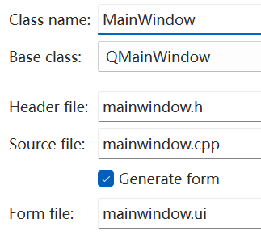
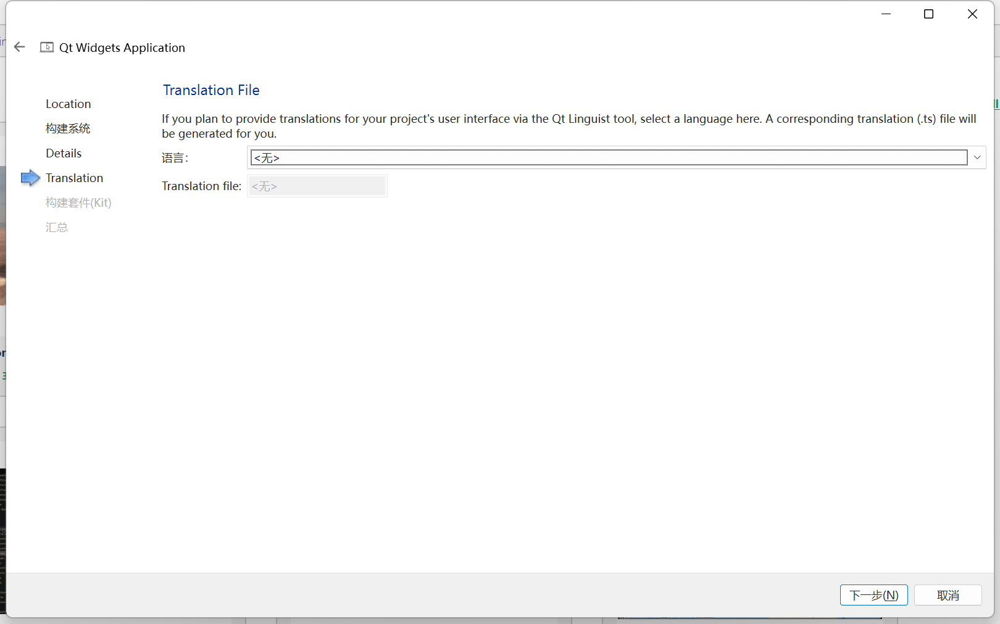
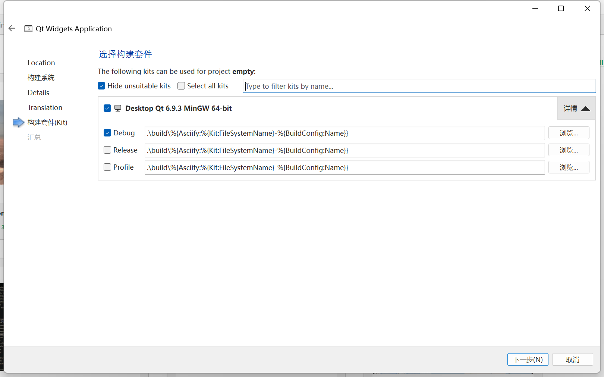
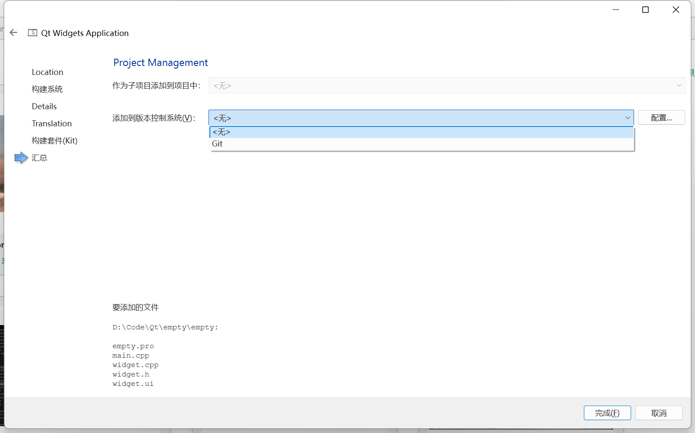
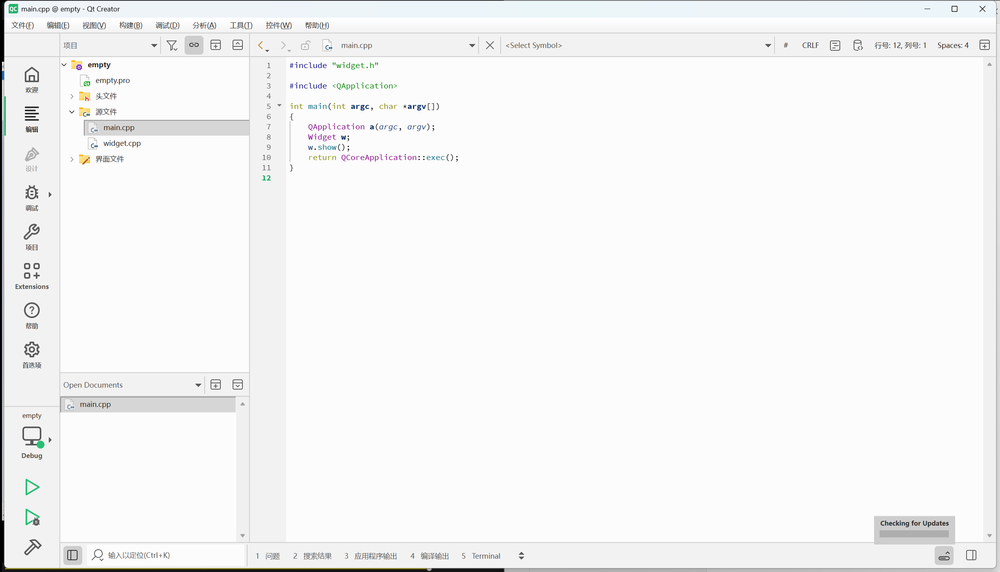
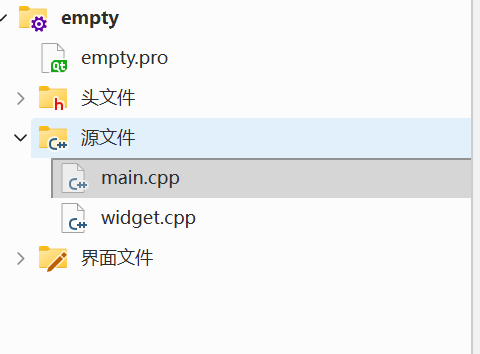

## 创建选项

使用Qt创建项目的时候，会自动的生成一些代码出来，生成的代码就包含一个类，此处就是要选择这个自动生成的父类是谁

-  QMainWindow 完整的应用程序窗口（可以包含菜单栏，工具栏，状态栏...）
- QWidget 表示一个控件（窗口上的一个具体元素：输入框、按钮、下拉框、单选按键、复选按钮...）
QDialog 表示一个对话框 

Qt中内置的类都是以Q前缀开头的，此处生成的文件名和类名是关联的，但是这样的关联并非是强制的（不过推荐搞成一样的）

**form file**
Qt中创建图形化界面的程序，有两种方式
- 直接通过C++代码的方式创建界面
- 通过form file，以图形化的方式来生成界面。此时就可以使用Qt Designer或者Qt Creator来编辑这个ui文件，从而以图形化的方式快速方便的生成图形界面

## 语言
这里我们的语言先不关注，这是国际化需要的

## 编译器
这里是选择以安装时安装的哪个编译器来构建后续代码

## 版本控制器
这里可以选择Qt代码的版本控制器，后期可以用git等进行版本管理

## 创建完成

## 项目目录
- .pro 为功能文件
- .h为头文件
- sources 是.cpp文件
- .ui为ui界面文件

