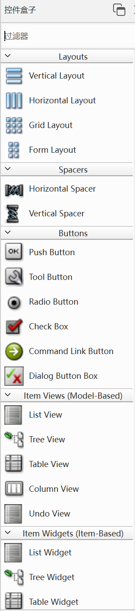

## 控件概述

编程讲究的是“站在巨人的肩膀上”，而不是“从头发明轮子”

一个图形化界面上的内容，不需要咱们全部从零去实现，Qt中已经提供了很多内置控件（按钮、文本框、复选按钮、下拉框、单选按钮...），咱们可以直接用

控件Widget，是界面上各种元素，各个部分的“统称”

Qt Designer左侧的一长条就是Qt内置好的控件

上古时期，开发GUI没有什么控件的概念。

界面上显示出来的内容，都是“画”出来的

显示器显示的内容可以理解为画布，操作系统就可以提供一些api，让你在画布上画，画点，画线，画矩形，画三角形，填充各种颜色等。这个时候开发一个图形化界面的程序，就相当于先画一个窗口（矩形）

但是这样的效率是相当低的，后来就有了控件的概念

早期的控件比较简单，数量也比较有限

比如HTML

包含了很多标签，不同标签有不同效果

\ 图片

\<a\> 链接

\<input> 输入框

\<button> 按钮

随着时代的发展，新的GUI开发体系越来越丰富，提供的控件数量/质量越来越好

比如Element这样的现代化控件体系，效果会更好
Qt的控件虽然很多，但整体来说，颜值还是比更现代的控件体系要逊色一筹

Qt Designer中展示的控件都是默认样子

Qt还提供了一些优化手段，可以让控件变得更好看

近几年Qt Design Studio被推出对标现代化界面体系，但是是收费的
