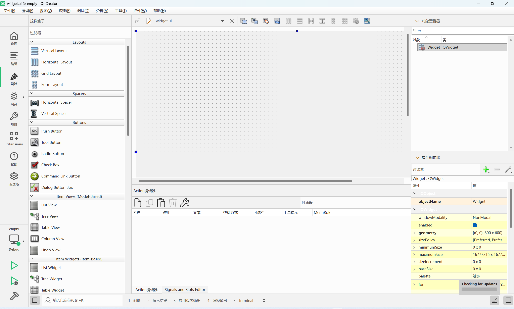
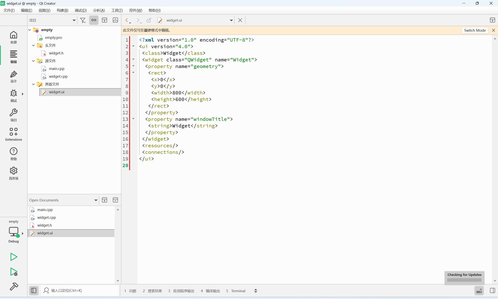

## 整体代码
```C++
#include "widget.h"

#include <QApplication>

int main(int argc, char *argv[])
{
    QApplication a(argc, argv);
    Widget w;
    w.show();
    return QCoreApplication::exec();
}
```

- QApplication: 编写一个QT图形化程序一定要有QApplication对象
- Widget：创建项目的时候，填写的生成的类名（Widget w; w.show();创建一个控件对象并显示出来）

**.show()**：让控件显示出来
**.hide()**：让控件隐藏

Widget的父类是QWidget 都是QWidget提供的接口

QCoreApplication::exec()：exec执行
Linux中也学过exec函数，进程程序替换。把可执行文件中的代码和数据替换到当前进程中，这里Qt中的exec与linux中的没有任何关系，只是名字相同

```
就像问栈和堆，需要先问清是操作系统虚拟地址空间中的栈和堆还是数据结构中的等
```

## widget.h

```C++
#ifndef WIDGET_H
#define WIDGET_H

#include <QWidget>

QT_BEGIN_NAMESPACE
namespace Ui {
class Widget;
}
QT_END_NAMESPACE

class Widget : public QWidget
{
    Q_OBJECT

public:
    explicit Widget(QWidget *parent = nullptr);
    ~Widget() override;

private:
    Ui::Widget *ui;
};
#endif // WIDGET_H

```

**class Widget : public QWidget**: 创建项目时，选择的父类，QT SDK中内置的，要想使用这个类就要包含对应的头文件

QT的设定，使用QT中的内置类，包含的头文件名与类名一致，当然头文件可能间接包含，要使用一个Qt的类，先直接写，如果能用就说明已经间接包含过了，无需显示包含。如果提示找不到类定义，再手动包含即可

**Q_OBJECT** ：Q_OBJECT是Qt的内置宏，本质上是文本替换。Q_OBJECT展开后是一大堆的代码，与Qt中非常核心的机制，“信号”和“槽”有关。如果某个类想使用信号和槽，就要引入Q_OBJECT这个宏


**QWidget \*parent = nullptr**：“Qt中引入了“对象树”机制，创建Qt对象就可以把这个对象挂在对象树上，往对象树上挂的时候就需要指定”父节点“（此处的对象树就是一个普通N叉树，不是二叉树）

## widget.cpp
```C++
#include "widget.h"
#include "ui_widget.h"

Widget::Widget(QWidget *parent)
    : QWidget(parent)
    , ui(new Ui::Widget)
{
    ui->setupUi(this);
}

Widget::~Widget()
{
    delete ui;
}

```

就是简单的构造函数，new了一个Ui::Widget

## widget.ui

左侧为Qt的内置控件，右下角为控件属性

如果以编辑打开，会发现是一个xml文件，xml文件和html是非常类似的，都是以成对标签表示数据

xml的标签类型，含义都是程序员自己自定义的，这里的标签由Qt的大佬们约定的，类似Linux网络中的自定义协议

html虽然也是通过标签表示，但是html的标签是固定的，每个标签的含义，有一个专门的标准委员会约定，所有浏览器也是按照这个标准规则来解释的

Qt中的xml文件是描述程序界面的样子的，进一步用qmake调用相关工具，依据这个xml来生成一些C++代码，从而把完整界面构建出来

## .pro文件
```
QT += widgets

CONFIG += c++17

# You can make your code fail to compile if it uses deprecated APIs.
# In order to do so, uncomment the following line.
#DEFINES += QT_DISABLE_DEPRECATED_BEFORE=0x060000    # disables all the APIs deprecated before Qt 6.0.0

SOURCES += \
    main.cpp \
    widget.cpp

HEADERS += \
    widget.h

FORMS += \
    widget.ui

# Default rules for deployment.
qnx: target.path = /tmp/$${TARGET}/bin
else: unix:!android: target.path = /opt/$${TARGET}/bin
!isEmpty(target.path): INSTALLS += target

```
- QT += widgets : 要引入的Qt模块
- CONFIG += c++17： 编译选项，用什么版本构建
- SOURCES、HEADERS、FORMS：描述了当前项目参与构建的文件都有哪些，编译器要编译哪些文件。这里不需要手动修改，Qt Creator自动维护好
这里的.pro文件时类似于Makefile文件，Makefile是一个很古老的技术了，qmake搭配.pro起到的作用和Makefile类似
Qt Creator把编译的细节都封装好了，不需要过多关注，点击运行就直接编译运行了

上面看到的.h .cpp .ui .pro 都是源代码，如果编译运行Qt项目，构建过程中还会有一些中间文件